# PyKis 라이브러리: 심층 아키텍처 분석

## 목차

1. [요약](#요약)
2. [시스템 개요 아키텍처](#시스템-개요-아키텍처)
3. [핵심 구성 요소 심층 분석](#핵심-구성-요소-심층-분석)
4. [디자인 패턴 및 아키텍처 결정 사항](#디자인-패턴-및-아키텍처-결정-사항)
5. [실시간 데이터 인프라](#실시간-데이터-인프라)
6. [API 계층 아키텍처](#api-계층-아키텍처)
7. [데이터 흐름 및 처리](#데이터-흐름-및-처리)
8. [타입 시스템 및 안전성](#타입-시스템-및-안전성)
9. [이벤트 기반 아키텍처](#이벤트-기반-아키텍처)
10. [인증 및 보안](#인증-및-보안)
11. [모듈 상호작용 패턴](#모듈-상호작용-패턴)
12. [확장성 및 성능 고려 사항](#확장성-및-성능-고려-사항)

---

## 요약

**PyKis** 라이브러리는 한국투자증권(KIS) 오픈 트레이딩 API를 위한 정교한 엔터프라이즈급 Python 래퍼입니다. 이 문서는 아키텍처 패턴, 설계 결정 및 구현 전략에 대한 심층 분석을 제공합니다.

### 주요 아키텍처 강점

- **프로토콜 기반 설계**: 타입 안전성 및 인터페이스 계약을 위한 Python 프로토콜의 광범위한 사용
- **어댑터 패턴 구현**: 기능 확장을 위한 정교한 믹스인 기반 구성
- **이벤트 기반 실시간 처리**: 자동 재연결 기능을 갖춘 강력한 웹소켓 인프라
- **스코프 기반 구성**: 명확한 관심사 분리를 통한 도메인 주도 설계
- **리소스 관리**: 자동 정리 및 구독 관리

### 아키텍처 품질 평가

| 측면          | 등급    | 참고                                         |
|---------------|---------|----------------------------------------------|
| **모듈성**    | ⭐⭐⭐⭐⭐ | 뛰어난 관심사 분리                           |
| **타입 안전성** | ⭐⭐⭐⭐⭐ | 포괄적인 프로토콜 기반 타이핑                |
| **확장성**    | ⭐⭐⭐⭐  | 잘 설계된 어댑터 패턴                        |
| **성능**      | ⭐⭐⭐⭐  | 효율적인 웹소켓 및 HTTP 처리                 |
| **유지보수성**  | ⭐⭐⭐   | 복잡한 상속 구조로 신중한 관리 필요          |

---

## 시스템 개요 아키텍처

PyKis 라이브러리는 프레젠테이션, 비즈니스 로직 및 인프라 문제 간의 명확한 분리를 갖춘 계층형 아키텍처를 따릅니다.

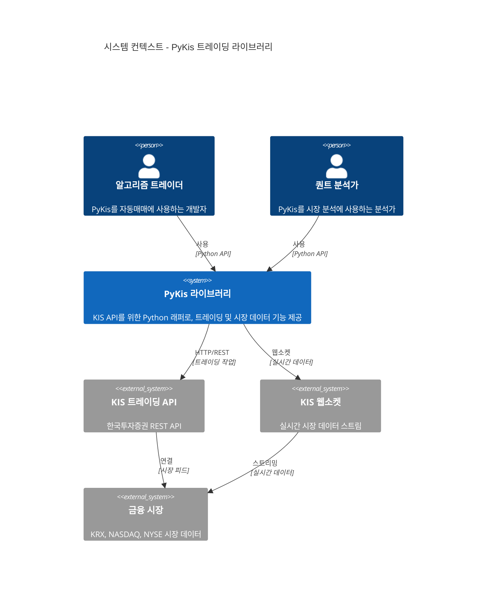
```mermaid
C4Context
    title 시스템 컨텍스트 - PyKis 트레이딩 라이브러리
    
    Person(trader, "알고리즘 트레이더", "PyKis를 자동매매에 사용하는 개발자")
    Person(quant, "퀀트 분석가", "PyKis를 시장 분석에 사용하는 분석가")
    
    System(pykis, "PyKis 라이브러리", "KIS API를 위한 Python 래퍼로, 트레이딩 및 시장 데이터 기능 제공")
    
    System_Ext(kis_api, "KIS 트레이딩 API", "한국투자증권 REST API")
    System_Ext(kis_ws, "KIS 웹소켓", "실시간 시장 데이터 스트림")
    System_Ext(markets, "금융 시장", "KRX, NASDAQ, NYSE 시장 데이터")
    
    Rel(trader, pykis, "사용", "Python API")
    Rel(quant, pykis, "사용", "Python API")
    Rel(pykis, kis_api, "HTTP/REST", "트레이딩 작업")
    Rel(pykis, kis_ws, "웹소켓", "실시간 데이터")
    Rel(kis_api, markets, "연결", "시장 피드")
    Rel(kis_ws, markets, "스트리밍", "실시간 데이터")
```

### 상위 수준 아키텍처 계층

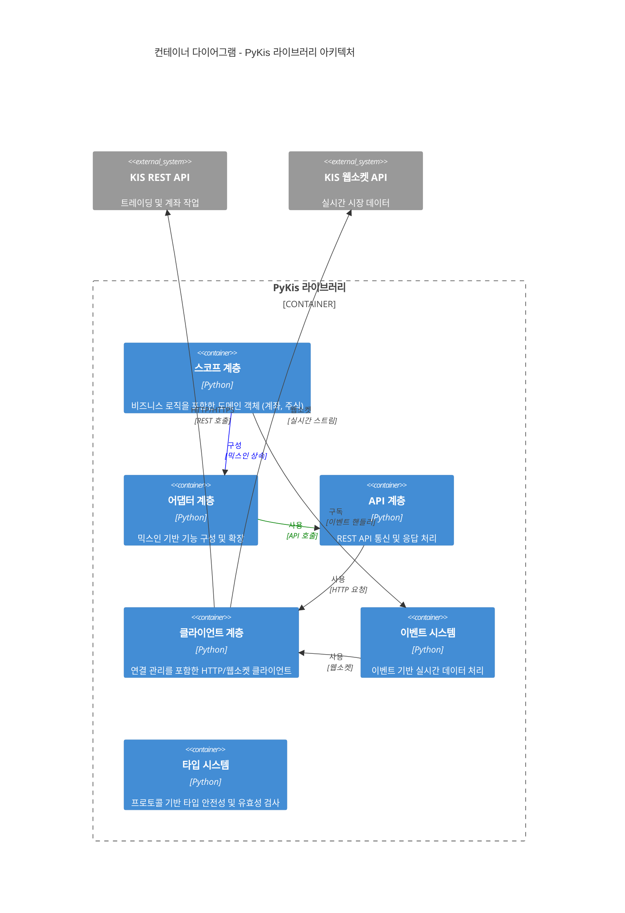
```mermaid
C4Container
    title 컨테이너 다이어그램 - PyKis 라이브러리 아키텍처
    
    Container_Boundary(pykis_lib, "PyKis 라이브러리") {
        Container(scope_layer, "스코프 계층", "Python", "비즈니스 로직을 포함한 도메인 객체 (계좌, 주식)")
        Container(adapter_layer, "어댑터 계층", "Python", "믹스인 기반 기능 구성 및 확장")
        Container(api_layer, "API 계층", "Python", "REST API 통신 및 응답 처리")
        Container(client_layer, "클라이언트 계층", "Python", "연결 관리를 포함한 HTTP/웹소켓 클라이언트")
        Container(event_system, "이벤트 시스템", "Python", "이벤트 기반 실시간 데이터 처리")
        Container(type_system, "타입 시스템", "Python", "프로토콜 기반 타입 안전성 및 유효성 검사")
    }
    
    System_Ext(kis_rest, "KIS REST API", "트레이딩 및 계좌 작업")
    System_Ext(kis_websocket, "KIS 웹소켓 API", "실시간 시장 데이터")
    
    Rel(scope_layer, adapter_layer, "구성", "믹스인 상속")
    Rel(adapter_layer, api_layer, "사용", "API 호출")
    Rel(api_layer, client_layer, "사용", "HTTP 요청")
    Rel(scope_layer, event_system, "구독", "이벤트 핸들러")
    Rel(event_system, client_layer, "사용", "웹소켓")
    
    Rel(client_layer, kis_rest, "HTTP/HTTPS", "REST 호출")
    Rel(client_layer, kis_websocket, "웹소켓", "실시간 스트림")
    
    UpdateRelStyle(scope_layer, adapter_layer, $textColor="blue", $lineColor="blue")
    UpdateRelStyle(adapter_layer, api_layer, $textColor="green", $lineColor="green")
```

---

## 핵심 구성 요소 심층 분석

### PyKis 메인 클래스 아키텍처

중앙 `PyKis` 클래스는 모든 라이브러리 작업의 조정 허브 역할을 합니다.

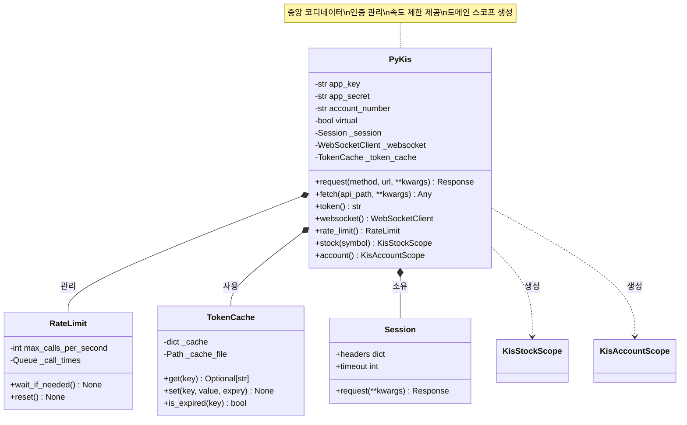
```mermaid
classDiagram
    class PyKis {
        -str app_key
        -str app_secret
        -str account_number
        -bool virtual
        -Session _session
        -WebSocketClient _websocket
        -TokenCache _token_cache
        
        +request(method, url, **kwargs) Response
        +fetch(api_path, **kwargs) Any
        +token() str
        +websocket() WebSocketClient
        +rate_limit() RateLimit
        +stock(symbol) KisStockScope
        +account() KisAccountScope
    }
    
    class RateLimit {
        -int max_calls_per_second
        -Queue _call_times
        +wait_if_needed() None
        +reset() None
    }
    
    class TokenCache {
        -dict _cache
        -Path _cache_file
        +get(key) Optional[str]
        +set(key, value, expiry) None
        +is_expired(key) bool
    }
    
    class Session {
        +request(**kwargs) Response
        +headers dict
        +timeout int
    }
    
    PyKis *-- RateLimit : 관리
    PyKis *-- TokenCache : 사용
    PyKis *-- Session : 소유
    PyKis ..> KisStockScope : 생성
    PyKis ..> KisAccountScope : 생성
    
    note for PyKis "중앙 코디네이터\n인증 관리\n속도 제한 제공\n도메인 스코프 생성"
```

### 스코프 기반 도메인 아키텍처

라이브러리는 관련 작업을 캡슐화하는 도메인별 스코프로 기능을 구성합니다.

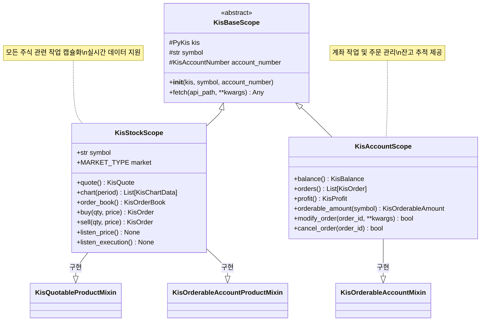
```mermaid
classDiagram
    class KisBaseScope {
        <<abstract>>
        #PyKis kis
        #str symbol
        #KisAccountNumber account_number
        
        +__init__(kis, symbol, account_number)
        +fetch(api_path, **kwargs) Any
    }
    
    class KisStockScope {
        +str symbol
        +MARKET_TYPE market
        
        +quote() KisQuote
        +chart(period) List[KisChartData]
        +order_book() KisOrderBook
        +buy(qty, price) KisOrder
        +sell(qty, price) KisOrder
        +listen_price() None
        +listen_execution() None
    }
    
    class KisAccountScope {
        +balance() KisBalance
        +orders() List[KisOrder]
        +profit() KisProfit
        +orderable_amount(symbol) KisOrderableAmount
        +modify_order(order_id, **kwargs) bool
        +cancel_order(order_id) bool
    }
    
    KisBaseScope <|-- KisStockScope
    KisBaseScope <|-- KisAccountScope
    
    KisStockScope --|> KisQuotableProductMixin : 구현
    KisStockScope --|> KisOrderableAccountProductMixin : 구현
    KisAccountScope --|> KisOrderableAccountMixin : 구현
    
    note for KisStockScope "모든 주식 관련 작업 캡슐화\n실시간 데이터 지원"
    note for KisAccountScope "계좌 작업 및 주문 관리\n잔고 추적 제공"
```

---

## 디자인 패턴 및 아키텍처 결정 사항

### 어댑터 패턴 구현

라이브러리는 Python 믹스인을 통해 어댑터 패턴을 광범위하게 사용하여 기능을 동적으로 구성합니다.

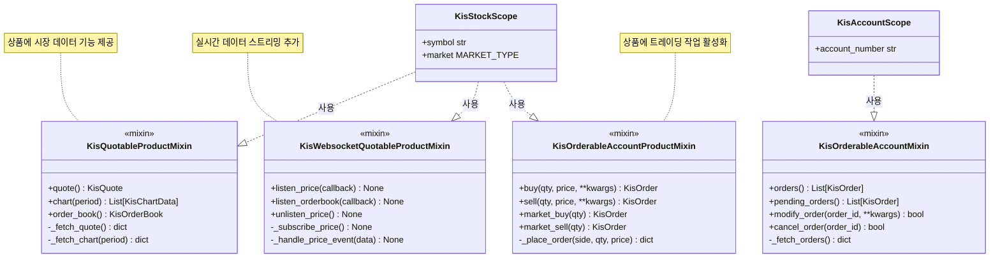
```mermaid
classDiagram
    class KisQuotableProductMixin {
        <<mixin>>
        +quote() KisQuote
        +chart(period) List[KisChartData]
        +order_book() KisOrderBook
        -_fetch_quote() dict
        -_fetch_chart(period) dict
    }
    
    class KisWebsocketQuotableProductMixin {
        <<mixin>>
        +listen_price(callback) None
        +listen_orderbook(callback) None
        +unlisten_price() None
        -_subscribe_price() None
        -_handle_price_event(data) None
    }
    
    class KisOrderableAccountProductMixin {
        <<mixin>>
        +buy(qty, price, **kwargs) KisOrder
        +sell(qty, price, **kwargs) KisOrder
        +market_buy(qty) KisOrder
        +market_sell(qty) KisOrder
        -_place_order(side, qty, price) dict
    }
    
    class KisOrderableAccountMixin {
        <<mixin>>
        +orders() List[KisOrder]
        +pending_orders() List[KisOrder]
        +modify_order(order_id, **kwargs) bool
        +cancel_order(order_id) bool
        -_fetch_orders() dict
    }
    
    class KisStockScope {
        +symbol str
        +market MARKET_TYPE
    }
    
    KisStockScope ..|> KisQuotableProductMixin : 사용
    KisStockScope ..|> KisWebsocketQuotableProductMixin : 사용
    KisStockScope ..|> KisOrderableAccountProductMixin : 사용
    
    class KisAccountScope {
        +account_number str
    }
    
    KisAccountScope ..|> KisOrderableAccountMixin : 사용
    
    note for KisQuotableProductMixin "상품에 시장 데이터 기능 제공"
    note for KisWebsocketQuotableProductMixin "실시간 데이터 스트리밍 추가"
    note for KisOrderableAccountProductMixin "상품에 트레이딩 작업 활성화"
```

### 프로토콜 기반 타입 시스템

라이브러리는 타입 안전성 및 인터페이스 계약을 위해 Python 프로토콜을 활용합니다.

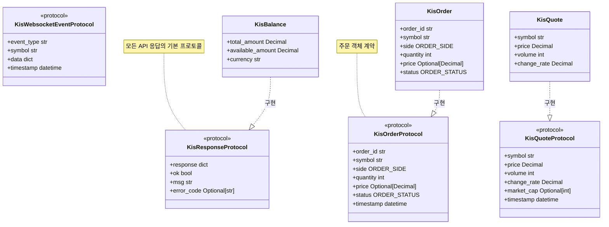
```mermaid
classDiagram
    class KisResponseProtocol {
        <<protocol>>
        +response dict
        +ok bool
        +msg str
        +error_code Optional[str]
    }
    
    class KisOrderProtocol {
        <<protocol>>
        +order_id str
        +symbol str
        +side ORDER_SIDE
        +quantity int
        +price Optional[Decimal]
        +status ORDER_STATUS
        +timestamp datetime
    }
    
    class KisQuoteProtocol {
        <<protocol>>
        +symbol str
        +price Decimal
        +volume int
        +change_rate Decimal
        +market_cap Optional[int]
        +timestamp datetime
    }
    
    class KisWebsocketEventProtocol {
        <<protocol>>
        +event_type str
        +symbol str
        +data dict
        +timestamp datetime
    }
    
    class KisBalance {
        +total_amount Decimal
        +available_amount Decimal
        +currency str
    }
    
    class KisOrder {
        +order_id str
        +symbol str
        +side ORDER_SIDE
        +quantity int
        +price Optional[Decimal]
        +status ORDER_STATUS
    }
    
    class KisQuote {
        +symbol str
        +price Decimal
        +volume int
        +change_rate Decimal
    }
    
    KisBalance ..|> KisResponseProtocol : 구현
    KisOrder ..|> KisOrderProtocol : 구현
    KisQuote ..|> KisQuoteProtocol : 구현
    
    note for KisResponseProtocol "모든 API 응답의 기본 프로토콜"
    note for KisOrderProtocol "주문 객체 계약"
```

---

## 실시간 데이터 인프라

### 웹소켓 클라이언트 아키텍처

웹소켓 인프라는 자동 재연결 및 구독 관리를 통해 강력한 실시간 데이터 스트리밍을 제공합니다.

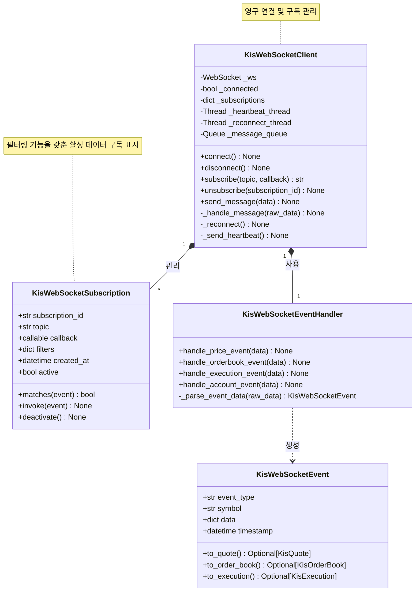
```mermaid
classDiagram
    class KisWebSocketClient {
        -WebSocket _ws
        -bool _connected
        -dict _subscriptions
        -Thread _heartbeat_thread
        -Thread _reconnect_thread
        -Queue _message_queue
        
        +connect() None
        +disconnect() None
        +subscribe(topic, callback) str
        +unsubscribe(subscription_id) None
        +send_message(data) None
        -_handle_message(raw_data) None
        -_reconnect() None
        -_send_heartbeat() None
    }
    
    class KisWebSocketSubscription {
        +str subscription_id
        +str topic
        +callable callback
        +dict filters
        +datetime created_at
        +bool active
        
        +matches(event) bool
        +invoke(event) None
        +deactivate() None
    }
    
    class KisWebSocketEventHandler {
        +handle_price_event(data) None
        +handle_orderbook_event(data) None
        +handle_execution_event(data) None
        +handle_account_event(data) None
        -_parse_event_data(raw_data) KisWebSocketEvent
    }
    
    class KisWebSocketEvent {
        +str event_type
        +str symbol
        +dict data
        +datetime timestamp
        
        +to_quote() Optional[KisQuote]
        +to_order_book() Optional[KisOrderBook]
        +to_execution() Optional[KisExecution]
    }
    
    KisWebSocketClient "1" *-- "*" KisWebSocketSubscription : 관리
    KisWebSocketClient "1" *-- "1" KisWebSocketEventHandler : 사용
    KisWebSocketEventHandler ..> KisWebSocketEvent : 생성
    
    note for KisWebSocketClient "영구 연결 및 구독 관리"
    note for KisWebSocketSubscription "필터링 기능을 갖춘 활성 데이터 구독 표시"
```

### 이벤트 시스템 아키텍처

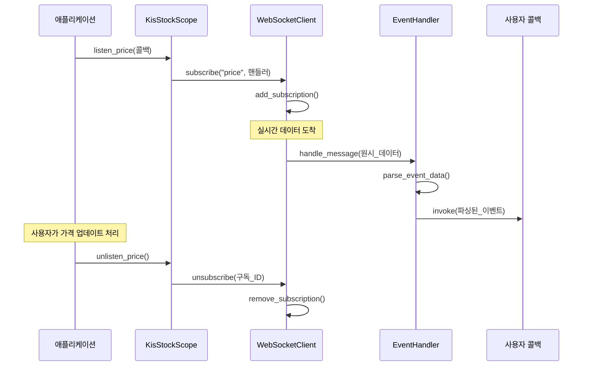
```mermaid
sequenceDiagram
    participant App as 애플리케이션
    participant Stock as KisStockScope
    participant WS as WebSocketClient
    participant Handler as EventHandler
    participant Callback as 사용자 콜백
    
    App->>Stock: listen_price(콜백)
    Stock->>WS: subscribe("price", 핸들러)
    WS->>WS: add_subscription()
    
    Note over WS: 실시간 데이터 도착
    WS->>Handler: handle_message(원시_데이터)
    Handler->>Handler: parse_event_data()
    Handler->>Callback: invoke(파싱된_이벤트)
    
    Note over App: 사용자가 가격 업데이트 처리
    
    App->>Stock: unlisten_price()
    Stock->>WS: unsubscribe(구독_ID)
    WS->>WS: remove_subscription()
```

---

## API 계층 아키텍처

### REST API 통신

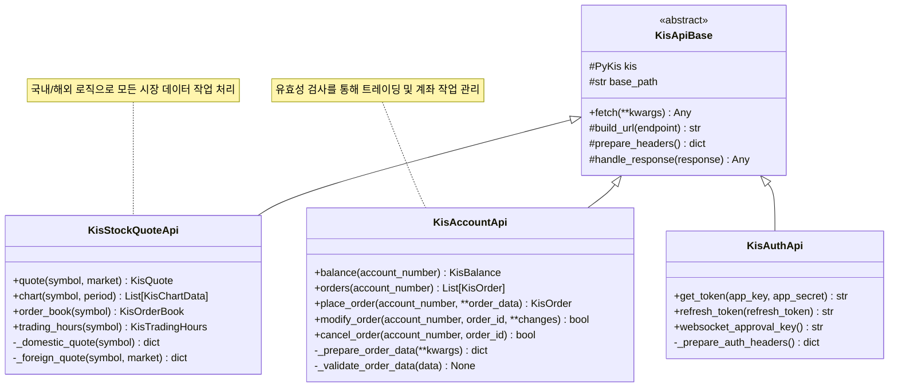
```mermaid
classDiagram
    class KisApiBase {
        <<abstract>>
        #PyKis kis
        #str base_path
        
        +fetch(**kwargs) Any
        #build_url(endpoint) str
        #prepare_headers() dict
        #handle_response(response) Any
    }
    
    class KisStockQuoteApi {
        +quote(symbol, market) KisQuote
        +chart(symbol, period) List[KisChartData]
        +order_book(symbol) KisOrderBook
        +trading_hours(symbol) KisTradingHours
        
        -_domestic_quote(symbol) dict
        -_foreign_quote(symbol, market) dict
    }
    
    class KisAccountApi {
        +balance(account_number) KisBalance
        +orders(account_number) List[KisOrder]
        +place_order(account_number, **order_data) KisOrder
        +modify_order(account_number, order_id, **changes) bool
        +cancel_order(account_number, order_id) bool
        
        -_prepare_order_data(**kwargs) dict
        -_validate_order_data(data) None
    }
    
    class KisAuthApi {
        +get_token(app_key, app_secret) str
        +refresh_token(refresh_token) str
        +websocket_approval_key() str
        
        -_prepare_auth_headers() dict
    }
    
    KisApiBase <|-- KisStockQuoteApi
    KisApiBase <|-- KisAccountApi  
    KisApiBase <|-- KisAuthApi
    
    note for KisStockQuoteApi "국내/해외 로직으로 모든 시장 데이터 작업 처리"
    note for KisAccountApi "유효성 검사를 통해 트레이딩 및 계좌 작업 관리"
```

### 응답 처리 파이프라인

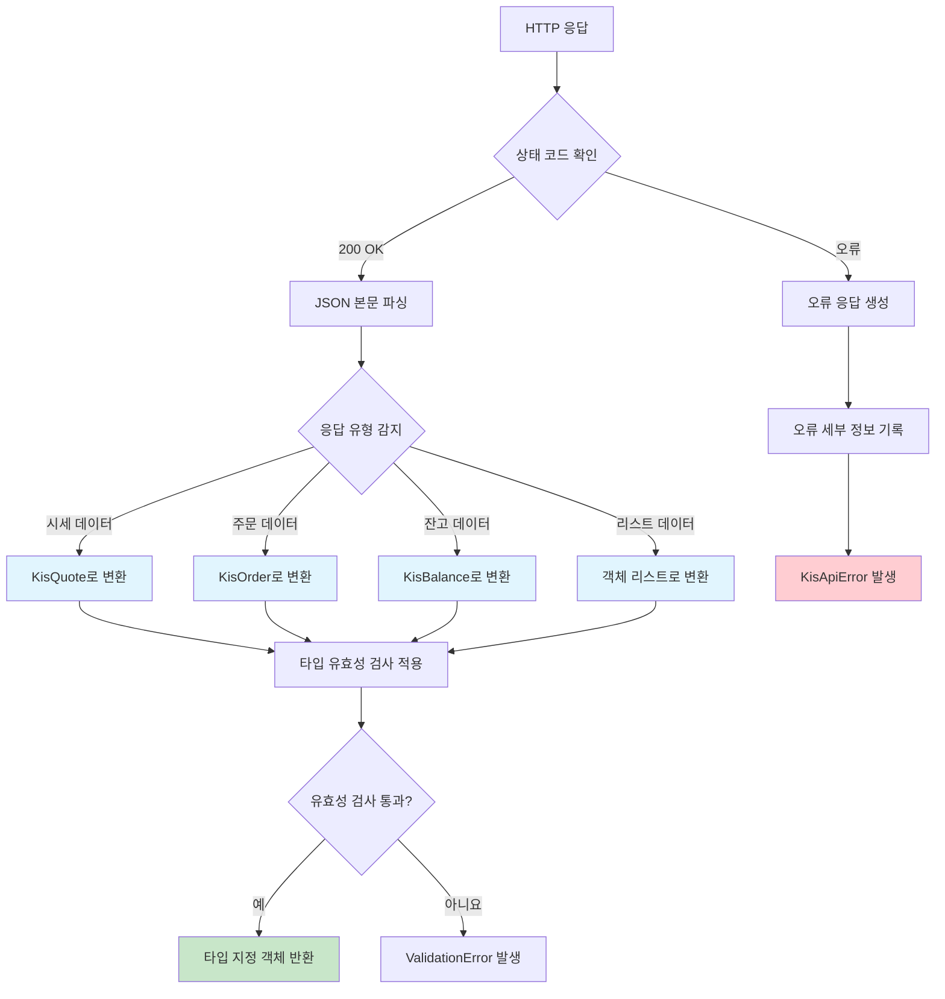
```mermaid
flowchart TD
    A[HTTP 응답] --> B{상태 코드 확인}
    B -->|200 OK| C[JSON 본문 파싱]
    B -->|오류| D[오류 응답 생성]
    
    C --> E{응답 유형 감지}
    E -->|시세 데이터| F[KisQuote로 변환]
    E -->|주문 데이터| G[KisOrder로 변환]
    E -->|잔고 데이터| H[KisBalance로 변환]
    E -->|리스트 데이터| I[객체 리스트로 변환]
    
    F --> J[타입 유효성 검사 적용]
    G --> J
    H --> J
    I --> J
    
    J --> K{유효성 검사 통과?}
    K -->|예| L[타입 지정 객체 반환]
    K -->|아니요| M[ValidationError 발생]
    
    D --> N[오류 세부 정보 기록]
    N --> O[KisApiError 발생]
    
    style F fill:#e1f5fe
    style G fill:#e1f5fe
    style H fill:#e1f5fe
    style I fill:#e1f5fe
    style L fill:#c8e6c9
    style O fill:#ffcdd2
```

---

## 데이터 흐름 및 처리

### 시장 데이터 흐름

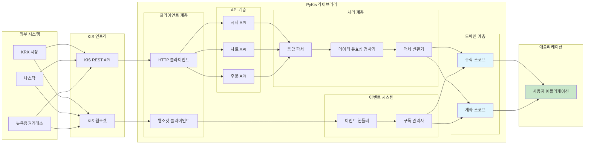
```mermaid
flowchart LR
    subgraph "외부 시스템"
        KRX[KRX 시장]
        NASDAQ[나스닥]
        NYSE[뉴욕증권거래소]
    end
    
    subgraph "KIS 인프라"
        KIS_REST[KIS REST API]
        KIS_WS[KIS 웹소켓]
    end
    
    subgraph "PyKis 라이브러리"
        subgraph "클라이언트 계층"
            HTTP[HTTP 클라이언트]
            WS[웹소켓 클라이언트]
        end
        
        subgraph "API 계층"
            QUOTE_API[시세 API]
            CHART_API[차트 API]
            ORDER_API[주문 API]
        end
        
        subgraph "처리 계층"
            PARSER[응답 파서]
            VALIDATOR[데이터 유효성 검사기]
            TRANSFORMER[객체 변환기]
        end
        
        subgraph "도메인 계층"
            STOCK[주식 스코프]
            ACCOUNT[계좌 스코프]
        end
        
        subgraph "이벤트 시스템"
            EVENT_HANDLER[이벤트 핸들러]
            SUBSCRIPTION[구독 관리자]
        end
    end
    
    subgraph "애플리케이션"
        USER_CODE[사용자 애플리케이션]
    end
    
    KRX --> KIS_REST
    NASDAQ --> KIS_REST
    NYSE --> KIS_REST
    
    KRX --> KIS_WS
    NASDAQ --> KIS_WS
    NYSE --> KIS_WS
    
    KIS_REST --> HTTP
    KIS_WS --> WS
    
    HTTP --> QUOTE_API
    HTTP --> CHART_API
    HTTP --> ORDER_API
    
    WS --> EVENT_HANDLER
    
    QUOTE_API --> PARSER
    CHART_API --> PARSER
    ORDER_API --> PARSER
    
    PARSER --> VALIDATOR
    VALIDATOR --> TRANSFORMER
    
    TRANSFORMER --> STOCK
    TRANSFORMER --> ACCOUNT
    
    EVENT_HANDLER --> SUBSCRIPTION
    SUBSCRIPTION --> STOCK
    SUBSCRIPTION --> ACCOUNT
    
    STOCK --> USER_CODE
    ACCOUNT --> USER_CODE
    
    style USER_CODE fill:#c8e6c9
    style STOCK fill:#e1f5fe
    style ACCOUNT fill:#e1f5fe
```

### 주문 실행 흐름

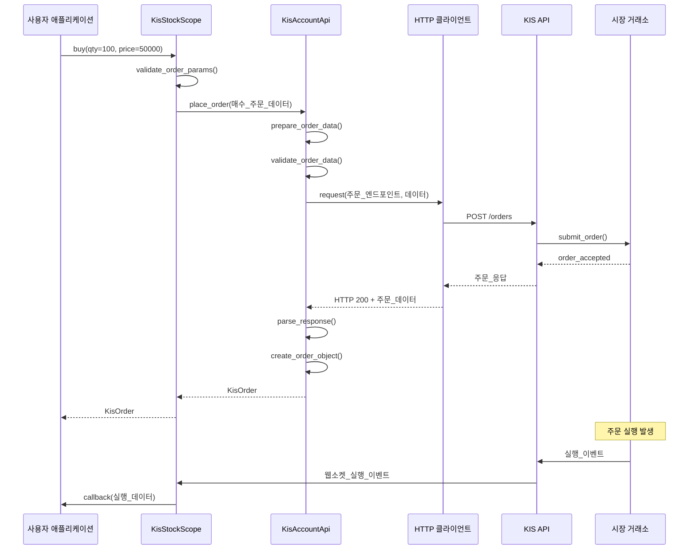
```mermaid
sequenceDiagram
    participant User as 사용자 애플리케이션
    participant Stock as KisStockScope
    participant OrderAPI as KisAccountApi
    participant HTTP as HTTP 클라이언트
    participant KIS as KIS API
    participant Market as 시장 거래소
    
    User->>Stock: buy(qty=100, price=50000)
    Stock->>Stock: validate_order_params()
    Stock->>OrderAPI: place_order(매수_주문_데이터)
    
    OrderAPI->>OrderAPI: prepare_order_data()
    OrderAPI->>OrderAPI: validate_order_data()
    OrderAPI->>HTTP: request(주문_엔드포인트, 데이터)
    
    HTTP->>KIS: POST /orders
    KIS->>Market: submit_order()
    Market-->>KIS: order_accepted
    KIS-->>HTTP: 주문_응답
    
    HTTP-->>OrderAPI: HTTP 200 + 주문_데이터
    OrderAPI->>OrderAPI: parse_response()
    OrderAPI->>OrderAPI: create_order_object()
    OrderAPI-->>Stock: KisOrder
    Stock-->>User: KisOrder
    
    Note over Market: 주문 실행 발생
    Market->>KIS: 실행_이벤트
    KIS->>Stock: 웹소켓_실행_이벤트
    Stock->>User: callback(실행_데이터)
```

---

## 타입 시스템 및 안전성

### 동적 응답 변환

라이브러리는 원시 API 응답을 강력한 타입의 Python 객체로 변환하기 위해 정교한 응답 변환을 사용합니다.

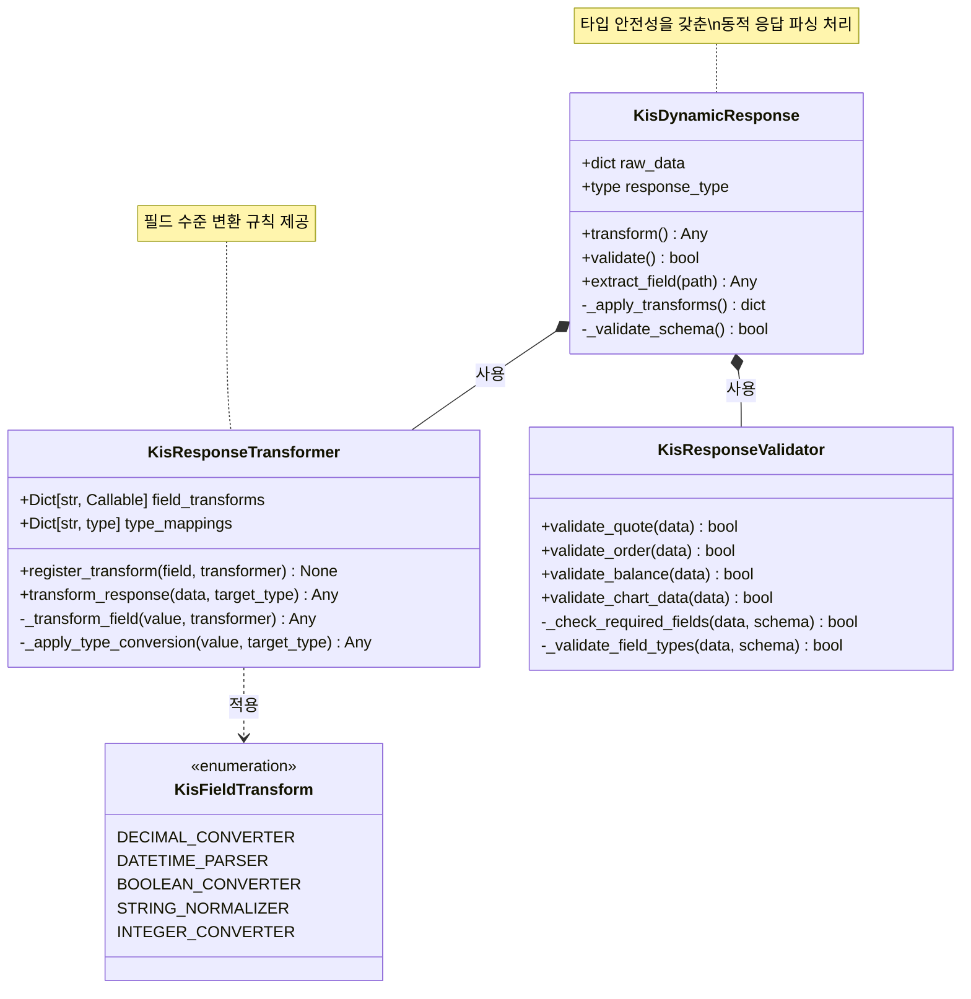
```mermaid
classDiagram
    class KisDynamicResponse {
        +dict raw_data
        +type response_type
        
        +transform() Any
        +validate() bool
        +extract_field(path) Any
        -_apply_transforms() dict
        -_validate_schema() bool
    }
    
    class KisResponseTransformer {
        +Dict[str, Callable] field_transforms
        +Dict[str, type] type_mappings
        
        +register_transform(field, transformer) None
        +transform_response(data, target_type) Any
        -_transform_field(value, transformer) Any
        -_apply_type_conversion(value, target_type) Any
    }
    
    class KisFieldTransform {
        <<enumeration>>
        DECIMAL_CONVERTER
        DATETIME_PARSER
        BOOLEAN_CONVERTER
        STRING_NORMALIZER
        INTEGER_CONVERTER
    }
    
    class KisResponseValidator {
        +validate_quote(data) bool
        +validate_order(data) bool
        +validate_balance(data) bool
        +validate_chart_data(data) bool
        
        -_check_required_fields(data, schema) bool
        -_validate_field_types(data, schema) bool
    }
    
    KisDynamicResponse *-- KisResponseTransformer : 사용
    KisResponseTransformer ..> KisFieldTransform : 적용
    KisDynamicResponse *-- KisResponseValidator : 사용
    
    note for KisDynamicResponse "타입 안전성을 갖춘\n동적 응답 파싱 처리"
    note for KisResponseTransformer "필드 수준 변환 규칙 제공"
```

### 타입 안전성 구현

```mermaid
block-beta
    columns 3
    
    block:input_layer:1
        Raw_JSON["원시 JSON 응답"]
    end
    
    block:validation_layer:1
        Schema_Check["스키마 유효성 검사"]
        Type_Check["타입 검사"]
        Field_Check["필수 필드 검사"]
    end
    
    block:transformation_layer:1
        Field_Transform["필드 변환"]
        Type_Convert["타입 변환"]
        Object_Create["객체 생성"]
    end
    
    Raw_JSON --> Schema_Check
    Schema_Check --> Type_Check
    Type_Check --> Field_Check
    Field_Check --> Field_Transform
    Field_Transform --> Type_Convert
    Type_Convert --> Object_Create
    
    style Raw_JSON fill:#ffcdd2
    style Schema_Check fill:#fff3e0
    style Type_Check fill:#fff3e0
    style Field_Check fill:#fff3e0
    style Field_Transform fill:#e8f5e8
    style Type_Convert fill:#e8f5e8
    style Object_Create fill:#c8e6c9
```

---

## 이벤트 기반 아키텍처

### 이벤트 처리 시스템

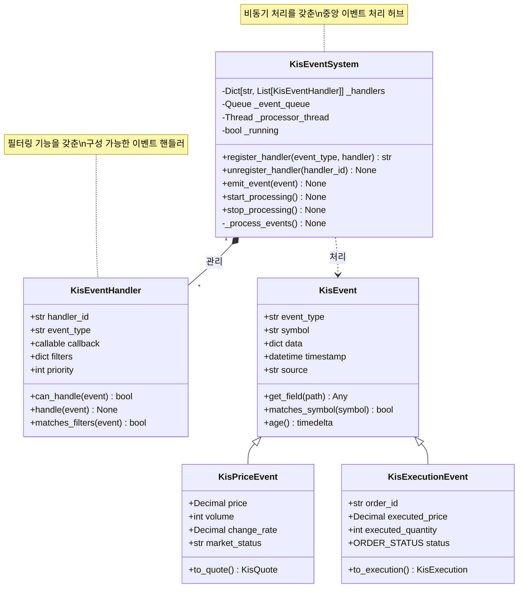
```mermaid
classDiagram
    class KisEventSystem {
        -Dict[str, List[KisEventHandler]] _handlers
        -Queue _event_queue
        -Thread _processor_thread
        -bool _running
        
        +register_handler(event_type, handler) str
        +unregister_handler(handler_id) None
        +emit_event(event) None
        +start_processing() None
        +stop_processing() None
        -_process_events() None
    }
    
    class KisEventHandler {
        +str handler_id
        +str event_type
        +callable callback
        +dict filters
        +int priority
        
        +can_handle(event) bool
        +handle(event) None
        +matches_filters(event) bool
    }
    
    class KisEvent {
        +str event_type
        +str symbol
        +dict data
        +datetime timestamp
        +str source
        
        +get_field(path) Any
        +matches_symbol(symbol) bool
        +age() timedelta
    }
    
    class KisPriceEvent {
        +Decimal price
        +int volume
        +Decimal change_rate
        +str market_status
        
        +to_quote() KisQuote
    }
    
    class KisExecutionEvent {
        +str order_id
        +Decimal executed_price
        +int executed_quantity
        +ORDER_STATUS status
        
        +to_execution() KisExecution
    }
    
    KisEventSystem "1" *-- "*" KisEventHandler : 관리
    KisEventSystem ..> KisEvent : 처리
    KisEvent <|-- KisPriceEvent
    KisEvent <|-- KisExecutionEvent
    
    note for KisEventSystem "비동기 처리를 갖춘\n중앙 이벤트 처리 허브"
    note for KisEventHandler "필터링 기능을 갖춘\n구성 가능한 이벤트 핸들러"
```

### 이벤트 흐름 아키텍처

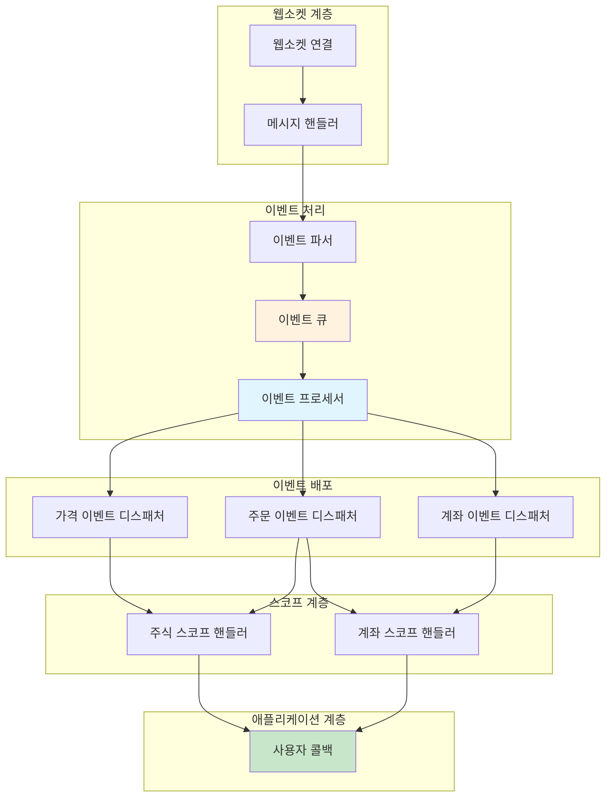
```mermaid
flowchart TD
    subgraph "웹소켓 계층"
        WS_CONN[웹소켓 연결]
        WS_HANDLER[메시지 핸들러]
    end
    
    subgraph "이벤트 처리"
        EVENT_PARSER[이벤트 파서]
        EVENT_QUEUE[이벤트 큐]
        EVENT_PROCESSOR[이벤트 프로세서]
    end
    
    subgraph "이벤트 배포"
        PRICE_DISPATCHER[가격 이벤트 디스패처]
        ORDER_DISPATCHER[주문 이벤트 디스패처]
        ACCOUNT_DISPATCHER[계좌 이벤트 디스패처]
    end
    
    subgraph "스코프 계층"
        STOCK_SCOPE[주식 스코프 핸들러]
        ACCOUNT_SCOPE[계좌 스코프 핸들러]
    end
    
    subgraph "애플리케이션 계층"
        USER_CALLBACKS[사용자 콜백]
    end
    
    WS_CONN --> WS_HANDLER
    WS_HANDLER --> EVENT_PARSER
    EVENT_PARSER --> EVENT_QUEUE
    EVENT_QUEUE --> EVENT_PROCESSOR
    
    EVENT_PROCESSOR --> PRICE_DISPATCHER
    EVENT_PROCESSOR --> ORDER_DISPATCHER
    EVENT_PROCESSOR --> ACCOUNT_DISPATCHER
    
    PRICE_DISPATCHER --> STOCK_SCOPE
    ORDER_DISPATCHER --> STOCK_SCOPE
    ORDER_DISPATCHER --> ACCOUNT_SCOPE
    ACCOUNT_DISPATCHER --> ACCOUNT_SCOPE
    
    STOCK_SCOPE --> USER_CALLBACKS
    ACCOUNT_SCOPE --> USER_CALLBACKS
    
    style EVENT_QUEUE fill:#fff3e0
    style EVENT_PROCESSOR fill:#e1f5fe
    style USER_CALLBACKS fill:#c8e6c9
```

---

## 인증 및 보안

### 토큰 관리 시스템

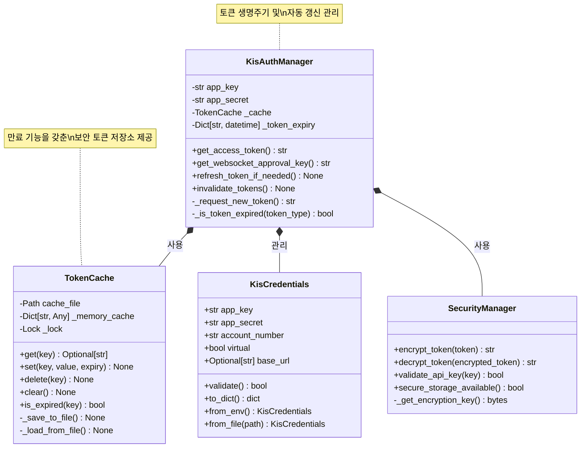
```mermaid
classDiagram
    class KisAuthManager {
        -str app_key
        -str app_secret
        -TokenCache _cache
        -Dict[str, datetime] _token_expiry
        
        +get_access_token() str
        +get_websocket_approval_key() str
        +refresh_token_if_needed() None
        +invalidate_tokens() None
        -_request_new_token() str
        -_is_token_expired(token_type) bool
    }
    
    class TokenCache {
        -Path cache_file
        -Dict[str, Any] _memory_cache
        -Lock _lock
        
        +get(key) Optional[str]
        +set(key, value, expiry) None
        +delete(key) None
        +clear() None
        +is_expired(key) bool
        -_save_to_file() None
        -_load_from_file() None
    }
    
    class KisCredentials {
        +str app_key
        +str app_secret
        +str account_number
        +bool virtual
        +Optional[str] base_url
        
        +validate() bool
        +to_dict() dict
        +from_env() KisCredentials
        +from_file(path) KisCredentials
    }
    
    class SecurityManager {
        +encrypt_token(token) str
        +decrypt_token(encrypted_token) str
        +validate_api_key(key) bool
        +secure_storage_available() bool
        -_get_encryption_key() bytes
    }
    
    KisAuthManager *-- TokenCache : 사용
    KisAuthManager *-- KisCredentials : 관리
    KisAuthManager *-- SecurityManager : 사용
    
    note for KisAuthManager "토큰 생명주기 및\n자동 갱신 관리"
    note for TokenCache "만료 기능을 갖춘\n보안 토큰 저장소 제공"
```

### 보안 흐름

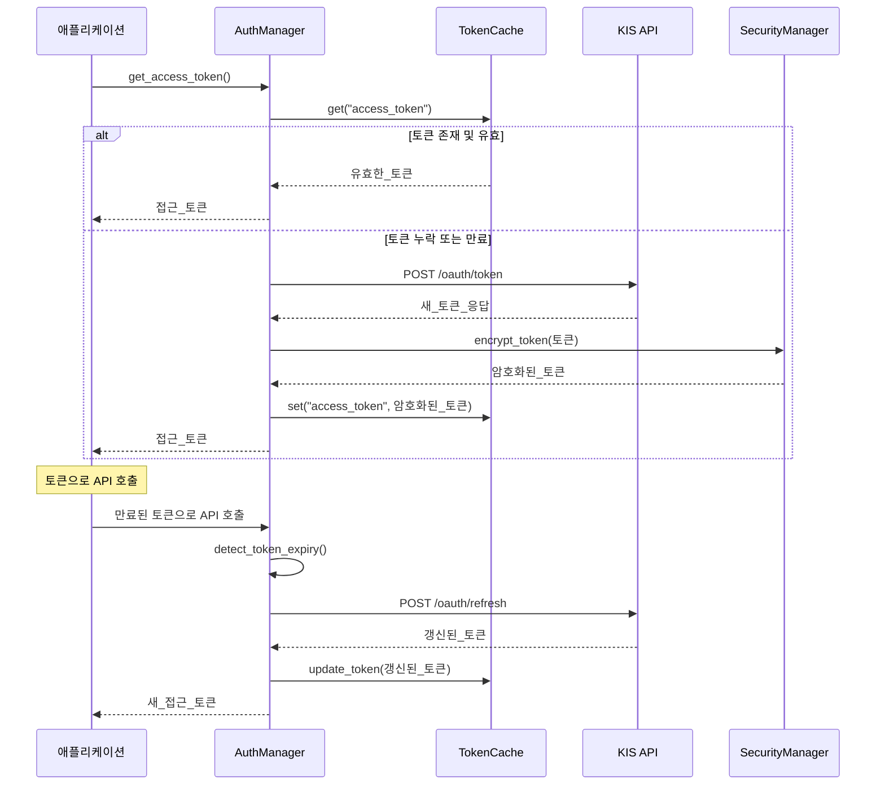
```mermaid
sequenceDiagram
    participant App as 애플리케이션
    participant Auth as AuthManager
    participant Cache as TokenCache
    participant KIS as KIS API
    participant Security as SecurityManager
    
    App->>Auth: get_access_token()
    Auth->>Cache: get("access_token")
    
    alt 토큰 존재 및 유효
        Cache-->>Auth: 유효한_토큰
        Auth-->>App: 접근_토큰
    else 토큰 누락 또는 만료
        Auth->>KIS: POST /oauth/token
        KIS-->>Auth: 새_토큰_응답
        Auth->>Security: encrypt_token(토큰)
        Security-->>Auth: 암호화된_토큰
        Auth->>Cache: set("access_token", 암호화된_토큰)
        Auth-->>App: 접근_토큰
    end
    
    Note over App: 토큰으로 API 호출
    
    App->>Auth: 만료된 토큰으로 API 호출
    Auth->>Auth: detect_token_expiry()
    Auth->>KIS: POST /oauth/refresh
    KIS-->>Auth: 갱신된_토큰
    Auth->>Cache: update_token(갱신된_토큰)
    Auth-->>App: 새_접근_토큰
```

---

## 모듈 상호작용 패턴

### 모듈 간 통신

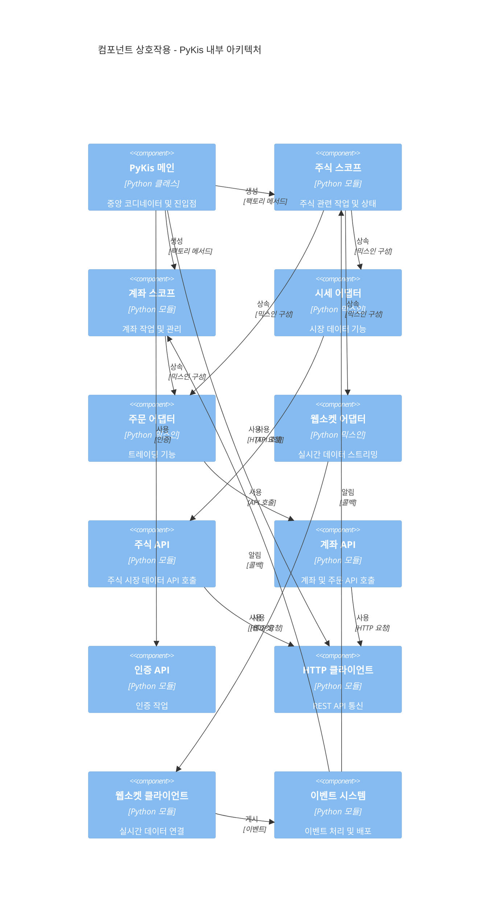
```mermaid
C4Component
    title 컴포넌트 상호작용 - PyKis 내부 아키텍처
    
    Component(pykis_main, "PyKis 메인", "Python 클래스", "중앙 코디네이터 및 진입점")
    Component(scope_stock, "주식 스코프", "Python 모듈", "주식 관련 작업 및 상태")
    Component(scope_account, "계좌 스코프", "Python 모듈", "계좌 작업 및 관리")
    
    Component(adapter_quote, "시세 어댑터", "Python 믹스인", "시장 데이터 기능")
    Component(adapter_order, "주문 어댑터", "Python 믹스인", "트레이딩 기능")
    Component(adapter_websocket, "웹소켓 어댑터", "Python 믹스인", "실시간 데이터 스트리밍")
    
    Component(api_stock, "주식 API", "Python 모듈", "주식 시장 데이터 API 호출")
    Component(api_account, "계좌 API", "Python 모듈", "계좌 및 주문 API 호출")
    Component(api_auth, "인증 API", "Python 모듈", "인증 작업")
    
    Component(client_http, "HTTP 클라이언트", "Python 모듈", "REST API 통신")
    Component(client_websocket, "웹소켓 클라이언트", "Python 모듈", "실시간 데이터 연결")
    Component(event_system, "이벤트 시스템", "Python 모듈", "이벤트 처리 및 배포")
    
    Rel(pykis_main, scope_stock, "생성", "팩토리 메서드")
    Rel(pykis_main, scope_account, "생성", "팩토리 메서드")
    Rel(pykis_main, client_http, "사용", "HTTP 요청")
    Rel(pykis_main, api_auth, "사용", "인증")
    
    Rel(scope_stock, adapter_quote, "상속", "믹스인 구성")
    Rel(scope_stock, adapter_websocket, "상속", "믹스인 구성")
    Rel(scope_stock, adapter_order, "상속", "믹스인 구성")
    
    Rel(scope_account, adapter_order, "상속", "믹스인 구성")
    
    Rel(adapter_quote, api_stock, "사용", "API 호출")
    Rel(adapter_order, api_account, "사용", "API 호출")
    Rel(adapter_websocket, client_websocket, "사용", "웹소켓")
    
    Rel(api_stock, client_http, "사용", "HTTP 요청")
    Rel(api_account, client_http, "사용", "HTTP 요청")
    
    Rel(client_websocket, event_system, "게시", "이벤트")
    Rel(event_system, scope_stock, "알림", "콜백")
    Rel(event_system, scope_account, "알림", "콜백")
```

### 의존성 그래프

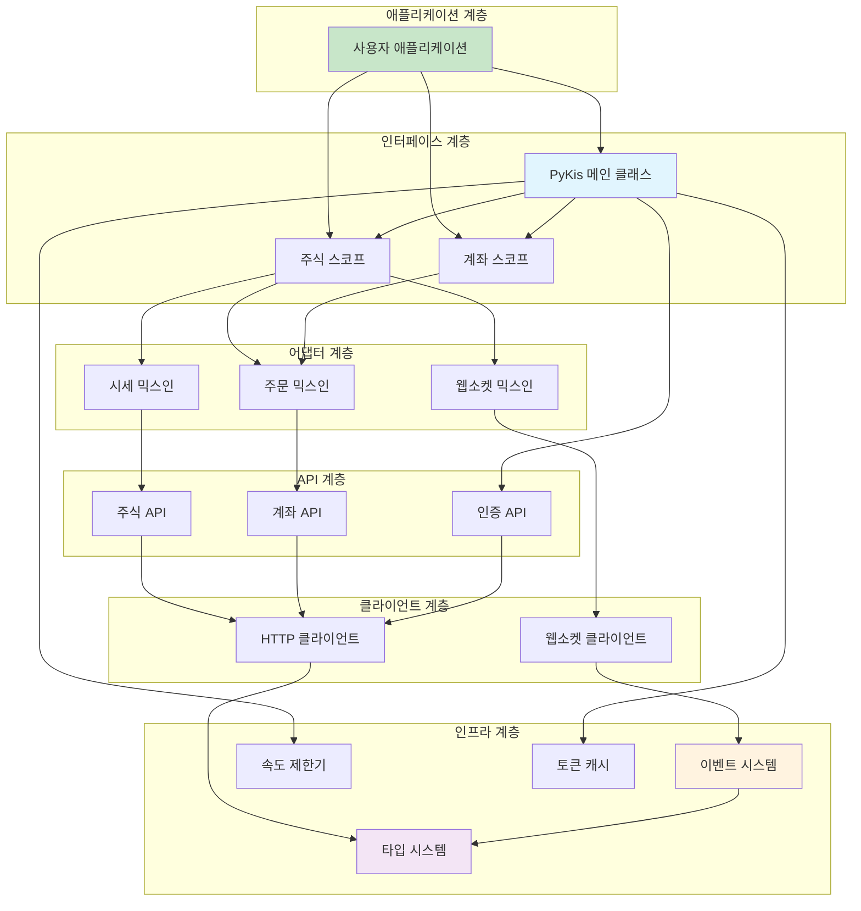
```mermaid
flowchart TD
    subgraph "애플리케이션 계층"
        USER[사용자 애플리케이션]
    end
    
    subgraph "인터페이스 계층"
        PYKIS[PyKis 메인 클래스]
        STOCK_SCOPE[주식 스코프]
        ACCOUNT_SCOPE[계좌 스코프]
    end
    
    subgraph "어댑터 계층"
        QUOTE_MIXIN[시세 믹스인]
        ORDER_MIXIN[주문 믹스인]
        WS_MIXIN[웹소켓 믹스인]
    end
    
    subgraph "API 계층"
        STOCK_API[주식 API]
        ACCOUNT_API[계좌 API]
        AUTH_API[인증 API]
    end
    
    subgraph "클라이언트 계층"
        HTTP_CLIENT[HTTP 클라이언트]
        WS_CLIENT[웹소켓 클라이언트]
    end
    
    subgraph "인프라 계층"
        EVENT_SYSTEM[이벤트 시스템]
        RATE_LIMIT[속도 제한기]
        TOKEN_CACHE[토큰 캐시]
        TYPE_SYSTEM[타입 시스템]
    end
    
    USER --> PYKIS
    USER --> STOCK_SCOPE
    USER --> ACCOUNT_SCOPE
    
    PYKIS --> STOCK_SCOPE
    PYKIS --> ACCOUNT_SCOPE
    PYKIS --> AUTH_API
    PYKIS --> RATE_LIMIT
    PYKIS --> TOKEN_CACHE
    
    STOCK_SCOPE --> QUOTE_MIXIN
    STOCK_SCOPE --> ORDER_MIXIN
    STOCK_SCOPE --> WS_MIXIN
    
    ACCOUNT_SCOPE --> ORDER_MIXIN
    
    QUOTE_MIXIN --> STOCK_API
    ORDER_MIXIN --> ACCOUNT_API
    WS_MIXIN --> WS_CLIENT
    
    STOCK_API --> HTTP_CLIENT
    ACCOUNT_API --> HTTP_CLIENT
    AUTH_API --> HTTP_CLIENT
    
    WS_CLIENT --> EVENT_SYSTEM
    
    HTTP_CLIENT --> TYPE_SYSTEM
    EVENT_SYSTEM --> TYPE_SYSTEM
    
    style USER fill:#c8e6c9
    style PYKIS fill:#e1f5fe
    style EVENT_SYSTEM fill:#fff3e0
    style TYPE_SYSTEM fill:#f3e5f5
```

---

## 확장성 및 성능 고려 사항

### 성능 최적화 전략

```mermaid
block-beta
    columns 3
    
    block:performance_layer:3
        columns 3
        Caching["응답 캐싱"] Connection_Pool["연결 풀링"] Rate_Limiting["속도 제한"]
    end
    
    block:optimization_layer:3
        columns 3
        Async_Processing["비동기 이벤트 처리"] Subscription_Mgmt["스마트 구독 관리"] Resource_Cleanup["자동 리소스 정리"]
    end
    
    block:monitoring_layer:3
        columns 3
        Metrics["성능 지표"] Health_Check["상태 모니터링"] Error_Recovery["오류 복구"]
    end
    
    Caching --> Async_Processing
    Connection_Pool --> Subscription_Mgmt
    Rate_Limiting --> Resource_Cleanup
    
    Async_Processing --> Metrics
    Subscription_Mgmt --> Health_Check
    Resource_Cleanup --> Error_Recovery
    
    style Caching fill:#e8f5e8
    style Connection_Pool fill:#e8f5e8
    style Rate_Limiting fill:#e8f5e8
    style Async_Processing fill:#e1f5fe
    style Subscription_Mgmt fill:#e1f5fe
    style Resource_Cleanup fill:#e1f5fe
    style Metrics fill:#fff3e0
    style Health_Check fill:#fff3e0
    style Error_Recovery fill:#fff3e0
```

### 메모리 관리 아키텍처

```mermaid
classDiagram
    class ResourceManager {
        -WeakSet active_scopes
        -Dict subscription_refs
        -Timer cleanup_timer
        
        +register_scope(scope) None
        +cleanup_inactive_scopes() None
        +monitor_memory_usage() None
        -_gc_collect() None
    }
    
    class SubscriptionManager {
        -Dict[str, WeakRef] subscriptions
        -int max_subscriptions
        -Queue subscription_queue
        
        +add_subscription(sub) str
        +remove_subscription(sub_id) None
        +cleanup_dead_subscriptions() None
        +get_subscription_count() int
    }
    
    class CacheManager {
        -LRUCache response_cache
        -TTLCache token_cache
        -int max_cache_size
        
        +get(key) Optional[Any]
        +set(key, value, ttl) None
        +evict_expired() None
        +clear_cache() None
    }
    
    class ConnectionPool {
        -Queue available_connections
        -Set active_connections
        -int max_connections
        -int connection_timeout
        
        +get_connection() Connection
        +return_connection(conn) None
        +close_all_connections() None
        +health_check() None
    }
    
    ResourceManager *-- SubscriptionManager : 사용
    ResourceManager *-- CacheManager : 사용
    ResourceManager *-- ConnectionPool : 사용
    
    note for ResourceManager "리소스 정리 및 모니터링 조정"
    note for SubscriptionManager "제한이 있는 웹소켓 구독 관리"
```

---

## 결론

PyKis 라이브러리는 최신 Python 디자인 패턴과 엔터프라이즈급 인프라 고려 사항을 사용하여 뛰어난 아키텍처 정교성을 보여줍니다. 프로토콜 기반 타입 안전성, 어댑터 패턴 구성 및 강력한 실시간 데이터 처리의 조합은 강력하고 유지 관리 가능한 트레이딩 라이브러리를 만듭니다.

### 주요 아키텍처 성과

1. **타입 안전성**: Python 프로토콜의 포괄적인 사용은 컴파일 타임 검사 및 뛰어난 IDE 지원을 보장합니다.
2. **모듈성**: 스코프 기반 구성 및 믹스인 구성을 통한 명확한 관심사 분리
3. **실시간 기능**: 자동 재연결 및 구독 관리를 갖춘 강력한 웹소켓 인프라
4. **리소스 관리**: 정교한 정리 및 모니터링 시스템으로 메모리 누수 방지
5. **확장성**: 잘 설계된 어댑터 패턴을 통해 핵심 수정 없이 쉽게 기능 확장 가능

### 잠재적 개선 영역

1. **API 명세 동기화**: 현재 KIS API 변경 사항과 일치하도록 정기적 업데이트
2. **테스트 커버리지**: 복잡한 상호 작용 시나리오에 대한 확장된 통합 테스트  
3. **성능 모니터링**: 운영 최적화를 위한 향상된 지표 수집
4. **문서화**: 진화하는 API 기능과의 지속적인 동기화

### 아키텍처 품질 요약

| 구성 요소              | 설계 품질 | 구현    | 유지보수성 |
|------------------------|-----------|---------|------------|
| **핵심 아키텍처**        | ⭐⭐⭐⭐⭐    | ⭐⭐⭐⭐  | ⭐⭐⭐⭐     |
| **타입 시스템**          | ⭐⭐⭐⭐⭐    | ⭐⭐⭐⭐⭐| ⭐⭐⭐⭐⭐   |
| **실시간 인프라**      | ⭐⭐⭐⭐⭐    | ⭐⭐⭐⭐  | ⭐⭐⭐⭐     |
| **API 계층**           | ⭐⭐⭐⭐     | ⭐⭐⭐   | ⭐⭐⭐      |
| **이벤트 시스템**        | ⭐⭐⭐⭐⭐    | ⭐⭐⭐⭐  | ⭐⭐⭐⭐     |

이 아키텍처 분석은 PyKis가 복잡성과 사용성 사이의 균형을 성공적으로 맞춘 잘 설계된 솔루션임을 보여주며, 한국 증권 시장의 알고리즘 트레이딩 애플리케이션을 위한 훌륭한 기반이 됩니다. 