# PyKis Library: Deep Architectural Analysis

## Table of Contents

1. [Executive Summary](#executive-summary)
2. [System Overview Architecture](#system-overview-architecture)
3. [Core Components Deep Dive](#core-components-deep-dive)
4. [Design Patterns and Architectural Decisions](#design-patterns-and-architectural-decisions)
5. [Real-time Data Infrastructure](#real-time-data-infrastructure)
6. [API Layer Architecture](#api-layer-architecture)
7. [Data Flow and Processing](#data-flow-and-processing)
8. [Type System and Safety](#type-system-and-safety)
9. [Event-Driven Architecture](#event-driven-architecture)
10. [Authentication and Security](#authentication-and-security)
11. [Module Interaction Patterns](#module-interaction-patterns)
12. [Scalability and Performance Considerations](#scalability-and-performance-considerations)

---

## Executive Summary

The **PyKis** library represents a sophisticated, enterprise-grade Python wrapper for the Korea Investment Securities (KIS) Open Trading API. This document provides an in-depth analysis of its architectural patterns, design decisions, and implementation strategies.

### Key Architectural Strengths

- **Protocol-Based Design**: Extensive use of Python protocols for type safety and interface contracts
- **Adapter Pattern Implementation**: Sophisticated mixin-based composition for feature extension
- **Event-Driven Real-time Processing**: Robust WebSocket infrastructure with automatic reconnection
- **Scope-Based Organization**: Domain-driven design with clear separation of concerns
- **Resource Management**: Automatic cleanup and subscription management

### Architecture Quality Assessment

| Aspect | Rating | Notes |
|--------|--------|--------|
| **Modularity** | ⭐⭐⭐⭐⭐ | Excellent separation of concerns |
| **Type Safety** | ⭐⭐⭐⭐⭐ | Comprehensive protocol-based typing |
| **Extensibility** | ⭐⭐⭐⭐ | Well-designed adapter patterns |
| **Performance** | ⭐⭐⭐⭐ | Efficient WebSocket and HTTP handling |
| **Maintainability** | ⭐⭐⭐ | Complex inheritance requires careful management |

---

## System Overview Architecture

The PyKis library follows a layered architecture with clear separation between presentation, business logic, and infrastructure concerns.

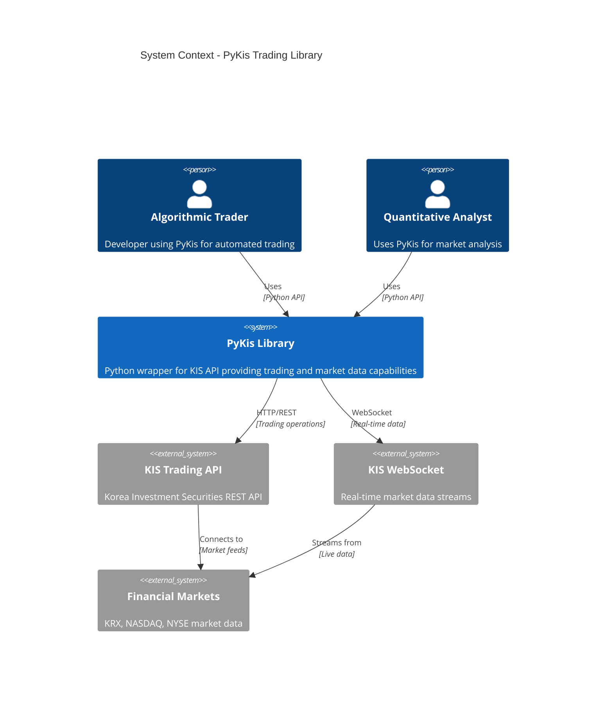
```mermaid
C4Context
    title System Context - PyKis Trading Library
    
    Person(trader, "Algorithmic Trader", "Developer using PyKis for automated trading")
    Person(quant, "Quantitative Analyst", "Uses PyKis for market analysis")
    
    System(pykis, "PyKis Library", "Python wrapper for KIS API providing trading and market data capabilities")
    
    System_Ext(kis_api, "KIS Trading API", "Korea Investment Securities REST API")
    System_Ext(kis_ws, "KIS WebSocket", "Real-time market data streams")
    System_Ext(markets, "Financial Markets", "KRX, NASDAQ, NYSE market data")
    
    Rel(trader, pykis, "Uses", "Python API")
    Rel(quant, pykis, "Uses", "Python API")
    Rel(pykis, kis_api, "HTTP/REST", "Trading operations")
    Rel(pykis, kis_ws, "WebSocket", "Real-time data")
    Rel(kis_api, markets, "Connects to", "Market feeds")
    Rel(kis_ws, markets, "Streams from", "Live data")
```

### High-Level Architecture Layers

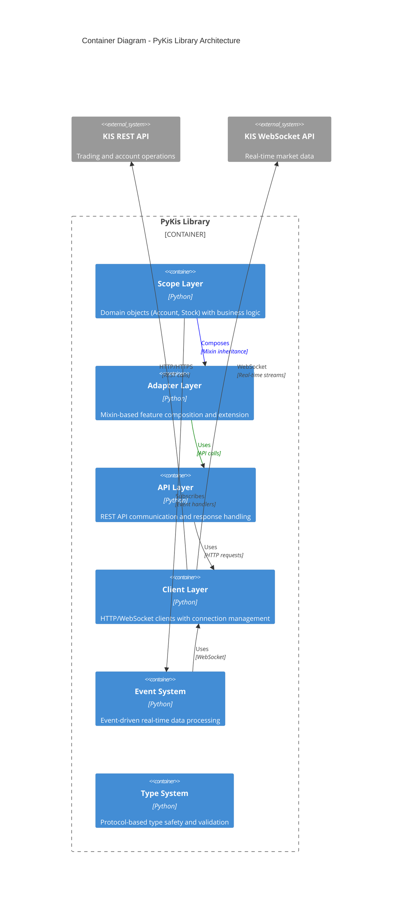
```mermaid
C4Container
    title Container Diagram - PyKis Library Architecture
    
    Container_Boundary(pykis_lib, "PyKis Library") {
        Container(scope_layer, "Scope Layer", "Python", "Domain objects (Account, Stock) with business logic")
        Container(adapter_layer, "Adapter Layer", "Python", "Mixin-based feature composition and extension")
        Container(api_layer, "API Layer", "Python", "REST API communication and response handling")
        Container(client_layer, "Client Layer", "Python", "HTTP/WebSocket clients with connection management")
        Container(event_system, "Event System", "Python", "Event-driven real-time data processing")
        Container(type_system, "Type System", "Python", "Protocol-based type safety and validation")
    }
    
    System_Ext(kis_rest, "KIS REST API", "Trading and account operations")
    System_Ext(kis_websocket, "KIS WebSocket API", "Real-time market data")
    
    Rel(scope_layer, adapter_layer, "Composes", "Mixin inheritance")
    Rel(adapter_layer, api_layer, "Uses", "API calls")
    Rel(api_layer, client_layer, "Uses", "HTTP requests")
    Rel(scope_layer, event_system, "Subscribes", "Event handlers")
    Rel(event_system, client_layer, "Uses", "WebSocket")
    
    Rel(client_layer, kis_rest, "HTTP/HTTPS", "REST calls")
    Rel(client_layer, kis_websocket, "WebSocket", "Real-time streams")
    
    UpdateRelStyle(scope_layer, adapter_layer, $textColor="blue", $lineColor="blue")
    UpdateRelStyle(adapter_layer, api_layer, $textColor="green", $lineColor="green")
```

---

## Core Components Deep Dive

### PyKis Main Class Architecture

The central `PyKis` class serves as the coordination hub for all library operations.

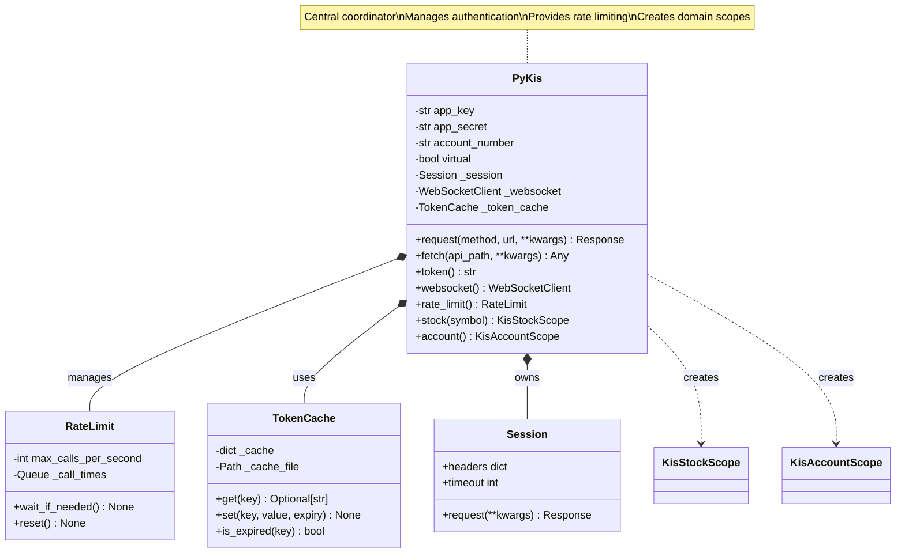
```mermaid
classDiagram
    class PyKis {
        -str app_key
        -str app_secret
        -str account_number
        -bool virtual
        -Session _session
        -WebSocketClient _websocket
        -TokenCache _token_cache
        
        +request(method, url, **kwargs) Response
        +fetch(api_path, **kwargs) Any
        +token() str
        +websocket() WebSocketClient
        +rate_limit() RateLimit
        +stock(symbol) KisStockScope
        +account() KisAccountScope
    }
    
    class RateLimit {
        -int max_calls_per_second
        -Queue _call_times
        +wait_if_needed() None
        +reset() None
    }
    
    class TokenCache {
        -dict _cache
        -Path _cache_file
        +get(key) Optional[str]
        +set(key, value, expiry) None
        +is_expired(key) bool
    }
    
    class Session {
        +request(**kwargs) Response
        +headers dict
        +timeout int
    }
    
    PyKis *-- RateLimit : manages
    PyKis *-- TokenCache : uses
    PyKis *-- Session : owns
    PyKis ..> KisStockScope : creates
    PyKis ..> KisAccountScope : creates
    
    note for PyKis "Central coordinator\nManages authentication\nProvides rate limiting\nCreates domain scopes"
```

### Scope-Based Domain Architecture

The library organizes functionality into domain-specific scopes that encapsulate related operations.

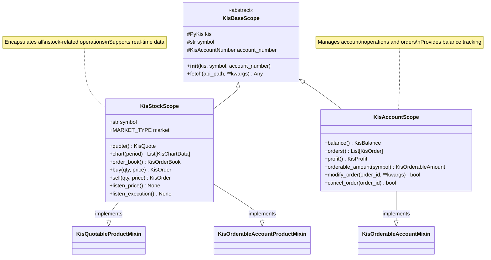
```mermaid
classDiagram
    class KisBaseScope {
        <<abstract>>
        #PyKis kis
        #str symbol
        #KisAccountNumber account_number
        
        +__init__(kis, symbol, account_number)
        +fetch(api_path, **kwargs) Any
    }
    
    class KisStockScope {
        +str symbol
        +MARKET_TYPE market
        
        +quote() KisQuote
        +chart(period) List[KisChartData]
        +order_book() KisOrderBook
        +buy(qty, price) KisOrder
        +sell(qty, price) KisOrder
        +listen_price() None
        +listen_execution() None
    }
    
    class KisAccountScope {
        +balance() KisBalance
        +orders() List[KisOrder]
        +profit() KisProfit
        +orderable_amount(symbol) KisOrderableAmount
        +modify_order(order_id, **kwargs) bool
        +cancel_order(order_id) bool
    }
    
    KisBaseScope <|-- KisStockScope
    KisBaseScope <|-- KisAccountScope
    
    KisStockScope --|> KisQuotableProductMixin : implements
    KisStockScope --|> KisOrderableAccountProductMixin : implements
    KisAccountScope --|> KisOrderableAccountMixin : implements
    
    note for KisStockScope "Encapsulates all\nstock-related operations\nSupports real-time data"
    note for KisAccountScope "Manages account\noperations and orders\nProvides balance tracking"
```

---

## Design Patterns and Architectural Decisions

### Adapter Pattern Implementation

The library extensively uses the Adapter pattern through Python mixins to compose functionality dynamically.

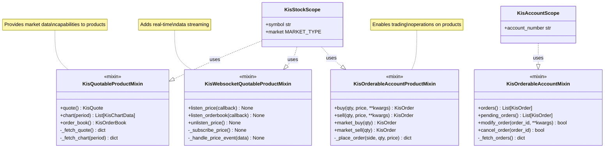
```mermaid
classDiagram
    class KisQuotableProductMixin {
        <<mixin>>
        +quote() KisQuote
        +chart(period) List[KisChartData]
        +order_book() KisOrderBook
        -_fetch_quote() dict
        -_fetch_chart(period) dict
    }
    
    class KisWebsocketQuotableProductMixin {
        <<mixin>>
        +listen_price(callback) None
        +listen_orderbook(callback) None
        +unlisten_price() None
        -_subscribe_price() None
        -_handle_price_event(data) None
    }
    
    class KisOrderableAccountProductMixin {
        <<mixin>>
        +buy(qty, price, **kwargs) KisOrder
        +sell(qty, price, **kwargs) KisOrder
        +market_buy(qty) KisOrder
        +market_sell(qty) KisOrder
        -_place_order(side, qty, price) dict
    }
    
    class KisOrderableAccountMixin {
        <<mixin>>
        +orders() List[KisOrder]
        +pending_orders() List[KisOrder]
        +modify_order(order_id, **kwargs) bool
        +cancel_order(order_id) bool
        -_fetch_orders() dict
    }
    
    class KisStockScope {
        +symbol str
        +market MARKET_TYPE
    }
    
    KisStockScope ..|> KisQuotableProductMixin : uses
    KisStockScope ..|> KisWebsocketQuotableProductMixin : uses
    KisStockScope ..|> KisOrderableAccountProductMixin : uses
    
    class KisAccountScope {
        +account_number str
    }
    
    KisAccountScope ..|> KisOrderableAccountMixin : uses
    
    note for KisQuotableProductMixin "Provides market data\ncapabilities to products"
    note for KisWebsocketQuotableProductMixin "Adds real-time\ndata streaming"
    note for KisOrderableAccountProductMixin "Enables trading\noperations on products"
```

### Protocol-Based Type System

The library leverages Python protocols for type safety and interface contracts.

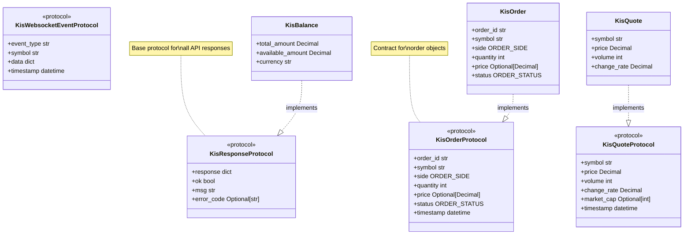
```mermaid
classDiagram
    class KisResponseProtocol {
        <<protocol>>
        +response dict
        +ok bool
        +msg str
        +error_code Optional[str]
    }
    
    class KisOrderProtocol {
        <<protocol>>
        +order_id str
        +symbol str
        +side ORDER_SIDE
        +quantity int
        +price Optional[Decimal]
        +status ORDER_STATUS
        +timestamp datetime
    }
    
    class KisQuoteProtocol {
        <<protocol>>
        +symbol str
        +price Decimal
        +volume int
        +change_rate Decimal
        +market_cap Optional[int]
        +timestamp datetime
    }
    
    class KisWebsocketEventProtocol {
        <<protocol>>
        +event_type str
        +symbol str
        +data dict
        +timestamp datetime
    }
    
    class KisBalance {
        +total_amount Decimal
        +available_amount Decimal
        +currency str
    }
    
    class KisOrder {
        +order_id str
        +symbol str
        +side ORDER_SIDE
        +quantity int
        +price Optional[Decimal]
        +status ORDER_STATUS
    }
    
    class KisQuote {
        +symbol str
        +price Decimal
        +volume int
        +change_rate Decimal
    }
    
    KisBalance ..|> KisResponseProtocol : implements
    KisOrder ..|> KisOrderProtocol : implements
    KisQuote ..|> KisQuoteProtocol : implements
    
    note for KisResponseProtocol "Base protocol for\nall API responses"
    note for KisOrderProtocol "Contract for\norder objects"
```

---

## Real-time Data Infrastructure

### WebSocket Client Architecture

The WebSocket infrastructure provides robust real-time data streaming with automatic reconnection and subscription management.

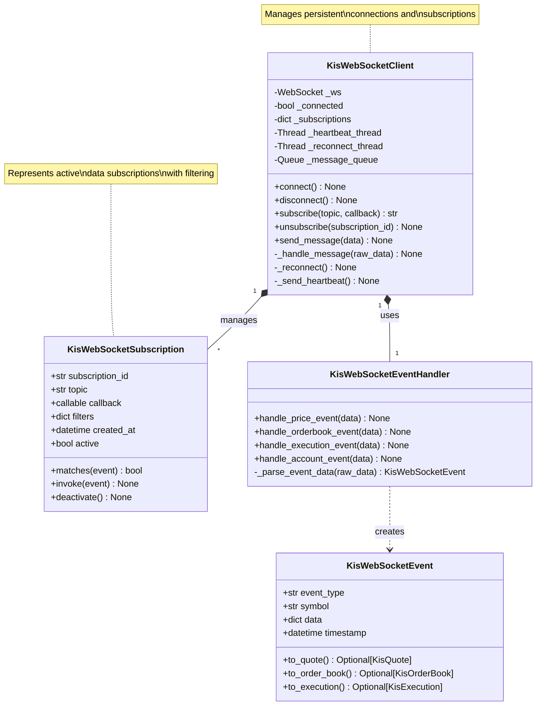
```mermaid
classDiagram
    class KisWebSocketClient {
        -WebSocket _ws
        -bool _connected
        -dict _subscriptions
        -Thread _heartbeat_thread
        -Thread _reconnect_thread
        -Queue _message_queue
        
        +connect() None
        +disconnect() None
        +subscribe(topic, callback) str
        +unsubscribe(subscription_id) None
        +send_message(data) None
        -_handle_message(raw_data) None
        -_reconnect() None
        -_send_heartbeat() None
    }
    
    class KisWebSocketSubscription {
        +str subscription_id
        +str topic
        +callable callback
        +dict filters
        +datetime created_at
        +bool active
        
        +matches(event) bool
        +invoke(event) None
        +deactivate() None
    }
    
    class KisWebSocketEventHandler {
        +handle_price_event(data) None
        +handle_orderbook_event(data) None
        +handle_execution_event(data) None
        +handle_account_event(data) None
        -_parse_event_data(raw_data) KisWebSocketEvent
    }
    
    class KisWebSocketEvent {
        +str event_type
        +str symbol
        +dict data
        +datetime timestamp
        
        +to_quote() Optional[KisQuote]
        +to_order_book() Optional[KisOrderBook]
        +to_execution() Optional[KisExecution]
    }
    
    KisWebSocketClient "1" *-- "*" KisWebSocketSubscription : manages
    KisWebSocketClient "1" *-- "1" KisWebSocketEventHandler : uses
    KisWebSocketEventHandler ..> KisWebSocketEvent : creates
    
    note for KisWebSocketClient "Manages persistent\nconnections and\nsubscriptions"
    note for KisWebSocketSubscription "Represents active\ndata subscriptions\nwith filtering"
```

### Event System Architecture

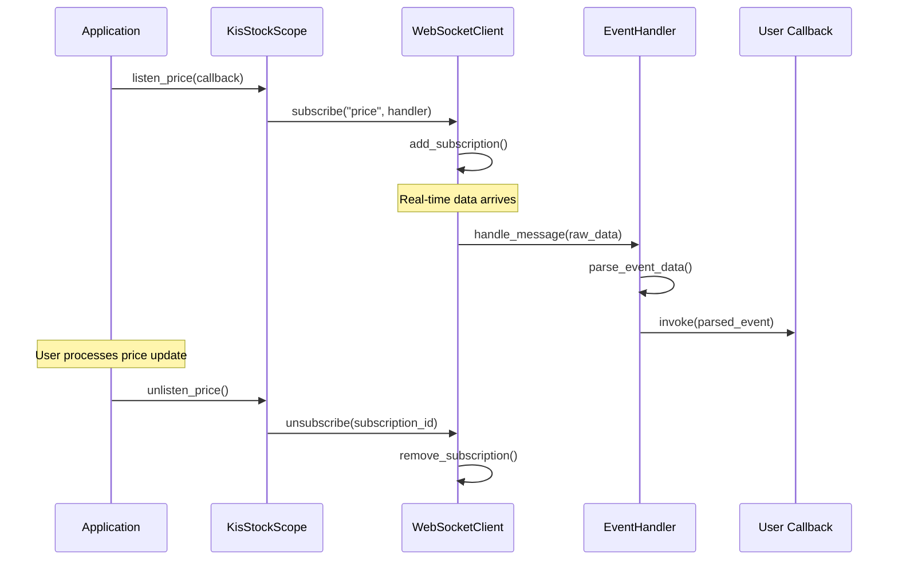
```mermaid
sequenceDiagram
    participant App as Application
    participant Stock as KisStockScope
    participant WS as WebSocketClient
    participant Handler as EventHandler
    participant Callback as User Callback
    
    App->>Stock: listen_price(callback)
    Stock->>WS: subscribe("price", handler)
    WS->>WS: add_subscription()
    
    Note over WS: Real-time data arrives
    WS->>Handler: handle_message(raw_data)
    Handler->>Handler: parse_event_data()
    Handler->>Callback: invoke(parsed_event)
    
    Note over App: User processes price update
    
    App->>Stock: unlisten_price()
    Stock->>WS: unsubscribe(subscription_id)
    WS->>WS: remove_subscription()
```

---

## API Layer Architecture

### REST API Communication

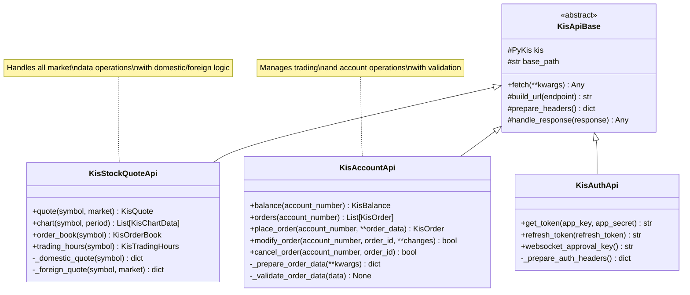
```mermaid
classDiagram
    class KisApiBase {
        <<abstract>>
        #PyKis kis
        #str base_path
        
        +fetch(**kwargs) Any
        #build_url(endpoint) str
        #prepare_headers() dict
        #handle_response(response) Any
    }
    
    class KisStockQuoteApi {
        +quote(symbol, market) KisQuote
        +chart(symbol, period) List[KisChartData]
        +order_book(symbol) KisOrderBook
        +trading_hours(symbol) KisTradingHours
        
        -_domestic_quote(symbol) dict
        -_foreign_quote(symbol, market) dict
    }
    
    class KisAccountApi {
        +balance(account_number) KisBalance
        +orders(account_number) List[KisOrder]
        +place_order(account_number, **order_data) KisOrder
        +modify_order(account_number, order_id, **changes) bool
        +cancel_order(account_number, order_id) bool
        
        -_prepare_order_data(**kwargs) dict
        -_validate_order_data(data) None
    }
    
    class KisAuthApi {
        +get_token(app_key, app_secret) str
        +refresh_token(refresh_token) str
        +websocket_approval_key() str
        
        -_prepare_auth_headers() dict
    }
    
    KisApiBase <|-- KisStockQuoteApi
    KisApiBase <|-- KisAccountApi  
    KisApiBase <|-- KisAuthApi
    
    note for KisStockQuoteApi "Handles all market\ndata operations\nwith domestic/foreign logic"
    note for KisAccountApi "Manages trading\nand account operations\nwith validation"
```

### Response Processing Pipeline

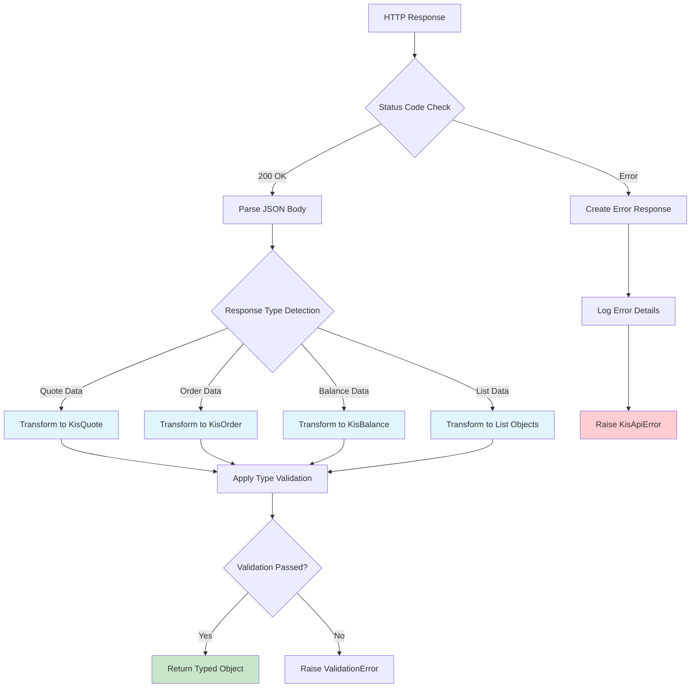
```mermaid
flowchart TD
    A[HTTP Response] --> B{Status Code Check}
    B -->|200 OK| C[Parse JSON Body]
    B -->|Error| D[Create Error Response]
    
    C --> E{Response Type Detection}
    E -->|Quote Data| F[Transform to KisQuote]
    E -->|Order Data| G[Transform to KisOrder]
    E -->|Balance Data| H[Transform to KisBalance]
    E -->|List Data| I[Transform to List Objects]
    
    F --> J[Apply Type Validation]
    G --> J
    H --> J
    I --> J
    
    J --> K{Validation Passed?}
    K -->|Yes| L[Return Typed Object]
    K -->|No| M[Raise ValidationError]
    
    D --> N[Log Error Details]
    N --> O[Raise KisApiError]
    
    style F fill:#e1f5fe
    style G fill:#e1f5fe
    style H fill:#e1f5fe
    style I fill:#e1f5fe
    style L fill:#c8e6c9
    style O fill:#ffcdd2
```

---

## Data Flow and Processing

### Market Data Flow

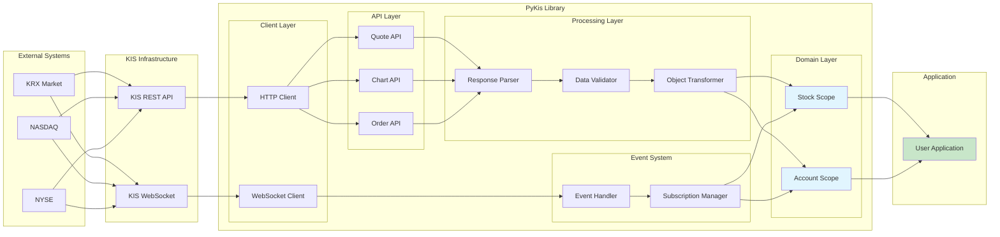
```mermaid
flowchart LR
    subgraph "External Systems"
        KRX[KRX Market]
        NASDAQ[NASDAQ]
        NYSE[NYSE]
    end
    
    subgraph "KIS Infrastructure"
        KIS_REST[KIS REST API]
        KIS_WS[KIS WebSocket]
    end
    
    subgraph "PyKis Library"
        subgraph "Client Layer"
            HTTP[HTTP Client]
            WS[WebSocket Client]
        end
        
        subgraph "API Layer"
            QUOTE_API[Quote API]
            CHART_API[Chart API]
            ORDER_API[Order API]
        end
        
        subgraph "Processing Layer"
            PARSER[Response Parser]
            VALIDATOR[Data Validator]
            TRANSFORMER[Object Transformer]
        end
        
        subgraph "Domain Layer"
            STOCK[Stock Scope]
            ACCOUNT[Account Scope]
        end
        
        subgraph "Event System"
            EVENT_HANDLER[Event Handler]
            SUBSCRIPTION[Subscription Manager]
        end
    end
    
    subgraph "Application"
        USER_CODE[User Application]
    end
    
    KRX --> KIS_REST
    NASDAQ --> KIS_REST
    NYSE --> KIS_REST
    
    KRX --> KIS_WS
    NASDAQ --> KIS_WS
    NYSE --> KIS_WS
    
    KIS_REST --> HTTP
    KIS_WS --> WS
    
    HTTP --> QUOTE_API
    HTTP --> CHART_API
    HTTP --> ORDER_API
    
    WS --> EVENT_HANDLER
    
    QUOTE_API --> PARSER
    CHART_API --> PARSER
    ORDER_API --> PARSER
    
    PARSER --> VALIDATOR
    VALIDATOR --> TRANSFORMER
    
    TRANSFORMER --> STOCK
    TRANSFORMER --> ACCOUNT
    
    EVENT_HANDLER --> SUBSCRIPTION
    SUBSCRIPTION --> STOCK
    SUBSCRIPTION --> ACCOUNT
    
    STOCK --> USER_CODE
    ACCOUNT --> USER_CODE
    
    style USER_CODE fill:#c8e6c9
    style STOCK fill:#e1f5fe
    style ACCOUNT fill:#e1f5fe
```

### Order Execution Flow

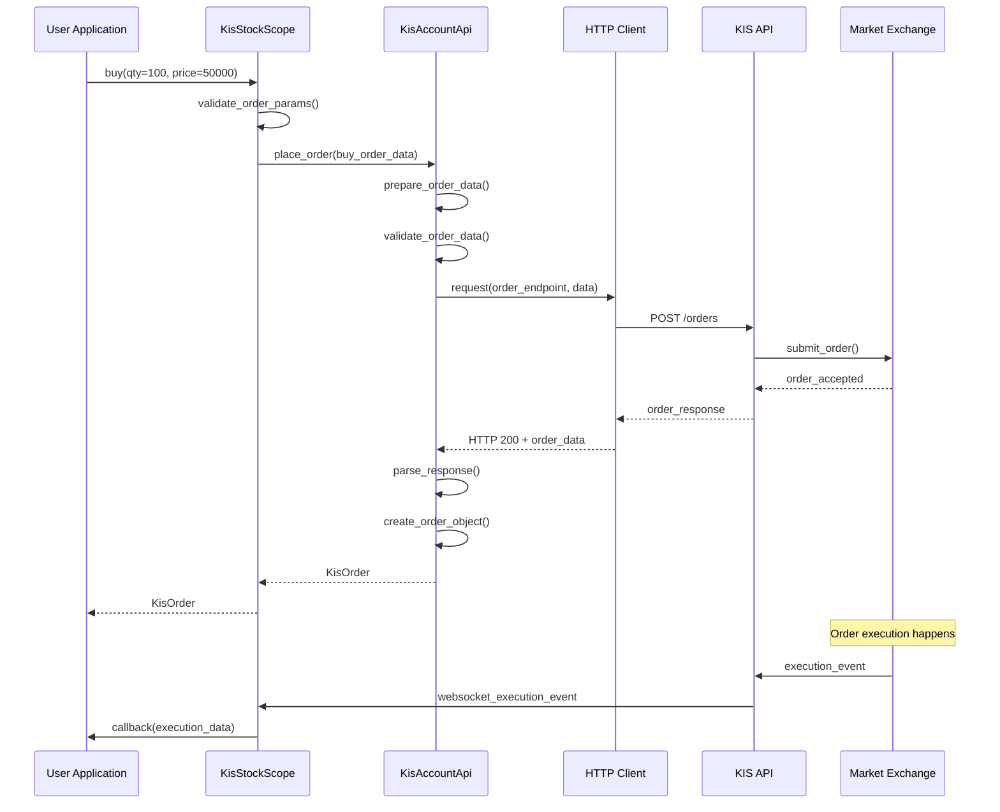
```mermaid
sequenceDiagram
    participant User as User Application
    participant Stock as KisStockScope
    participant OrderAPI as KisAccountApi
    participant HTTP as HTTP Client
    participant KIS as KIS API
    participant Market as Market Exchange
    
    User->>Stock: buy(qty=100, price=50000)
    Stock->>Stock: validate_order_params()
    Stock->>OrderAPI: place_order(buy_order_data)
    
    OrderAPI->>OrderAPI: prepare_order_data()
    OrderAPI->>OrderAPI: validate_order_data()
    OrderAPI->>HTTP: request(order_endpoint, data)
    
    HTTP->>KIS: POST /orders
    KIS->>Market: submit_order()
    Market-->>KIS: order_accepted
    KIS-->>HTTP: order_response
    
    HTTP-->>OrderAPI: HTTP 200 + order_data
    OrderAPI->>OrderAPI: parse_response()
    OrderAPI->>OrderAPI: create_order_object()
    OrderAPI-->>Stock: KisOrder
    Stock-->>User: KisOrder
    
    Note over Market: Order execution happens
    Market->>KIS: execution_event
    KIS->>Stock: websocket_execution_event
    Stock->>User: callback(execution_data)
```

---

## Type System and Safety

### Dynamic Response Transformation

The library employs sophisticated response transformation to convert raw API responses into strongly-typed Python objects.

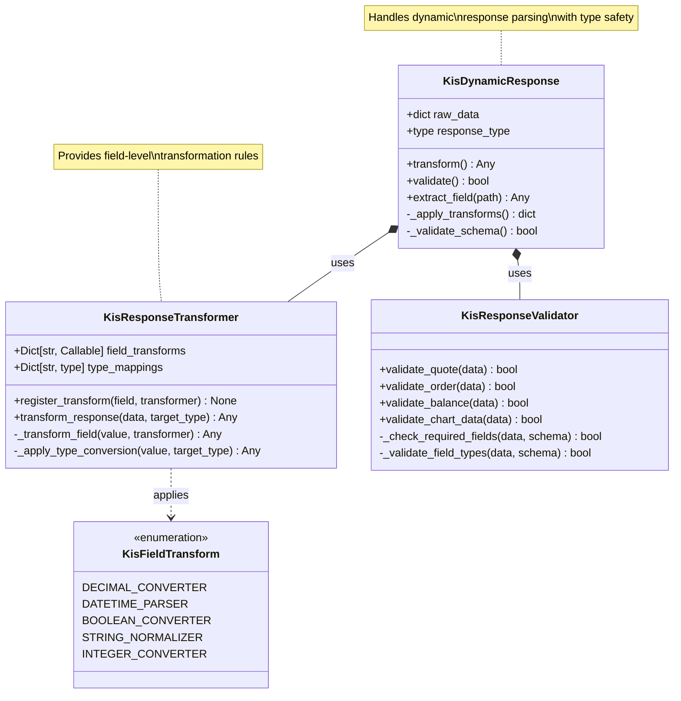
```mermaid
classDiagram
    class KisDynamicResponse {
        +dict raw_data
        +type response_type
        
        +transform() Any
        +validate() bool
        +extract_field(path) Any
        -_apply_transforms() dict
        -_validate_schema() bool
    }
    
    class KisResponseTransformer {
        +Dict[str, Callable] field_transforms
        +Dict[str, type] type_mappings
        
        +register_transform(field, transformer) None
        +transform_response(data, target_type) Any
        -_transform_field(value, transformer) Any
        -_apply_type_conversion(value, target_type) Any
    }
    
    class KisFieldTransform {
        <<enumeration>>
        DECIMAL_CONVERTER
        DATETIME_PARSER
        BOOLEAN_CONVERTER
        STRING_NORMALIZER
        INTEGER_CONVERTER
    }
    
    class KisResponseValidator {
        +validate_quote(data) bool
        +validate_order(data) bool
        +validate_balance(data) bool
        +validate_chart_data(data) bool
        
        -_check_required_fields(data, schema) bool
        -_validate_field_types(data, schema) bool
    }
    
    KisDynamicResponse *-- KisResponseTransformer : uses
    KisResponseTransformer ..> KisFieldTransform : applies
    KisDynamicResponse *-- KisResponseValidator : uses
    
    note for KisDynamicResponse "Handles dynamic\nresponse parsing\nwith type safety"
    note for KisResponseTransformer "Provides field-level\ntransformation rules"
```

### Type Safety Implementation

```mermaid
block-beta
    columns 3
    
    block:input_layer:1
        Raw_JSON["Raw JSON Response"]
    end
    
    block:validation_layer:1
        Schema_Check["Schema Validation"]
        Type_Check["Type Checking"]
        Field_Check["Required Fields"]
    end
    
    block:transformation_layer:1
        Field_Transform["Field Transformation"]
        Type_Convert["Type Conversion"]
        Object_Create["Object Creation"]
    end
    
    Raw_JSON --> Schema_Check
    Schema_Check --> Type_Check
    Type_Check --> Field_Check
    Field_Check --> Field_Transform
    Field_Transform --> Type_Convert
    Type_Convert --> Object_Create
    
    style Raw_JSON fill:#ffcdd2
    style Schema_Check fill:#fff3e0
    style Type_Check fill:#fff3e0
    style Field_Check fill:#fff3e0
    style Field_Transform fill:#e8f5e8
    style Type_Convert fill:#e8f5e8
    style Object_Create fill:#c8e6c9
```

---

## Event-Driven Architecture

### Event Processing System

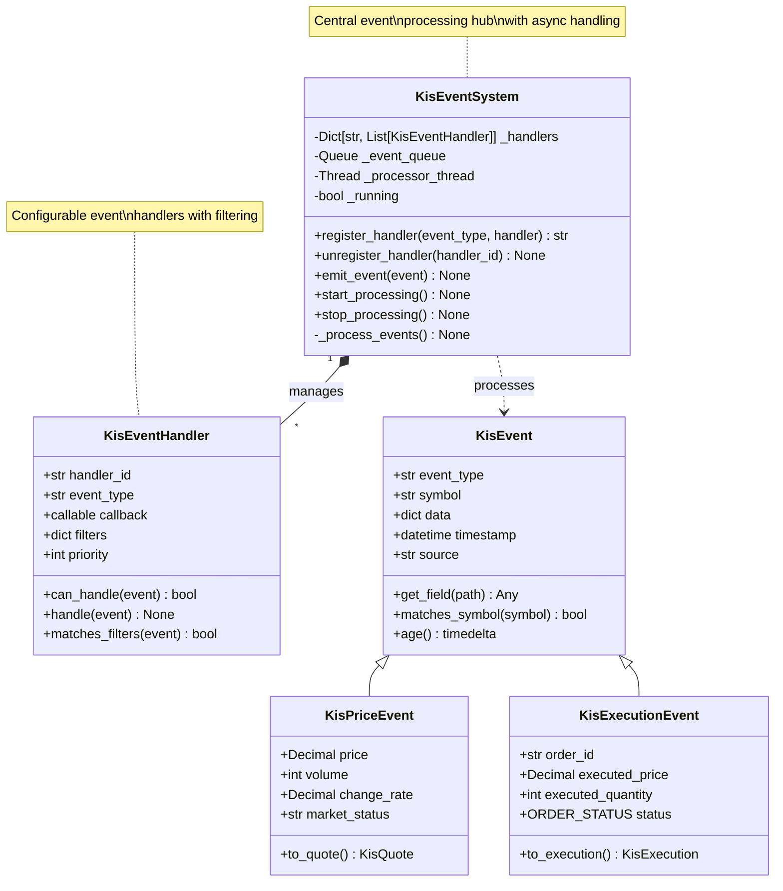
```mermaid
classDiagram
    class KisEventSystem {
        -Dict[str, List[KisEventHandler]] _handlers
        -Queue _event_queue
        -Thread _processor_thread
        -bool _running
        
        +register_handler(event_type, handler) str
        +unregister_handler(handler_id) None
        +emit_event(event) None
        +start_processing() None
        +stop_processing() None
        -_process_events() None
    }
    
    class KisEventHandler {
        +str handler_id
        +str event_type
        +callable callback
        +dict filters
        +int priority
        
        +can_handle(event) bool
        +handle(event) None
        +matches_filters(event) bool
    }
    
    class KisEvent {
        +str event_type
        +str symbol
        +dict data
        +datetime timestamp
        +str source
        
        +get_field(path) Any
        +matches_symbol(symbol) bool
        +age() timedelta
    }
    
    class KisPriceEvent {
        +Decimal price
        +int volume
        +Decimal change_rate
        +str market_status
        
        +to_quote() KisQuote
    }
    
    class KisExecutionEvent {
        +str order_id
        +Decimal executed_price
        +int executed_quantity
        +ORDER_STATUS status
        
        +to_execution() KisExecution
    }
    
    KisEventSystem "1" *-- "*" KisEventHandler : manages
    KisEventSystem ..> KisEvent : processes
    KisEvent <|-- KisPriceEvent
    KisEvent <|-- KisExecutionEvent
    
    note for KisEventSystem "Central event\nprocessing hub\nwith async handling"
    note for KisEventHandler "Configurable event\nhandlers with filtering"
```

### Event Flow Architecture

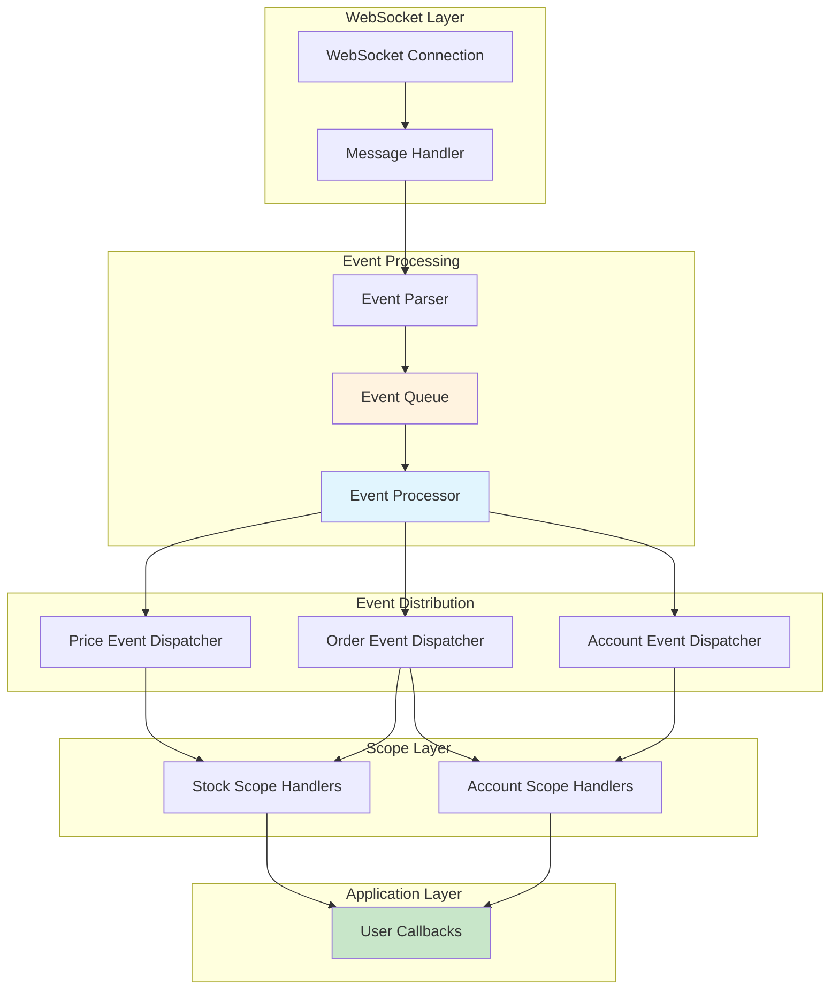
```mermaid
flowchart TD
    subgraph "WebSocket Layer"
        WS_CONN[WebSocket Connection]
        WS_HANDLER[Message Handler]
    end
    
    subgraph "Event Processing"
        EVENT_PARSER[Event Parser]
        EVENT_QUEUE[Event Queue]
        EVENT_PROCESSOR[Event Processor]
    end
    
    subgraph "Event Distribution"
        PRICE_DISPATCHER[Price Event Dispatcher]
        ORDER_DISPATCHER[Order Event Dispatcher]
        ACCOUNT_DISPATCHER[Account Event Dispatcher]
    end
    
    subgraph "Scope Layer"
        STOCK_SCOPE[Stock Scope Handlers]
        ACCOUNT_SCOPE[Account Scope Handlers]
    end
    
    subgraph "Application Layer"
        USER_CALLBACKS[User Callbacks]
    end
    
    WS_CONN --> WS_HANDLER
    WS_HANDLER --> EVENT_PARSER
    EVENT_PARSER --> EVENT_QUEUE
    EVENT_QUEUE --> EVENT_PROCESSOR
    
    EVENT_PROCESSOR --> PRICE_DISPATCHER
    EVENT_PROCESSOR --> ORDER_DISPATCHER
    EVENT_PROCESSOR --> ACCOUNT_DISPATCHER
    
    PRICE_DISPATCHER --> STOCK_SCOPE
    ORDER_DISPATCHER --> STOCK_SCOPE
    ORDER_DISPATCHER --> ACCOUNT_SCOPE
    ACCOUNT_DISPATCHER --> ACCOUNT_SCOPE
    
    STOCK_SCOPE --> USER_CALLBACKS
    ACCOUNT_SCOPE --> USER_CALLBACKS
    
    style EVENT_QUEUE fill:#fff3e0
    style EVENT_PROCESSOR fill:#e1f5fe
    style USER_CALLBACKS fill:#c8e6c9
```

---

## Authentication and Security

### Token Management System

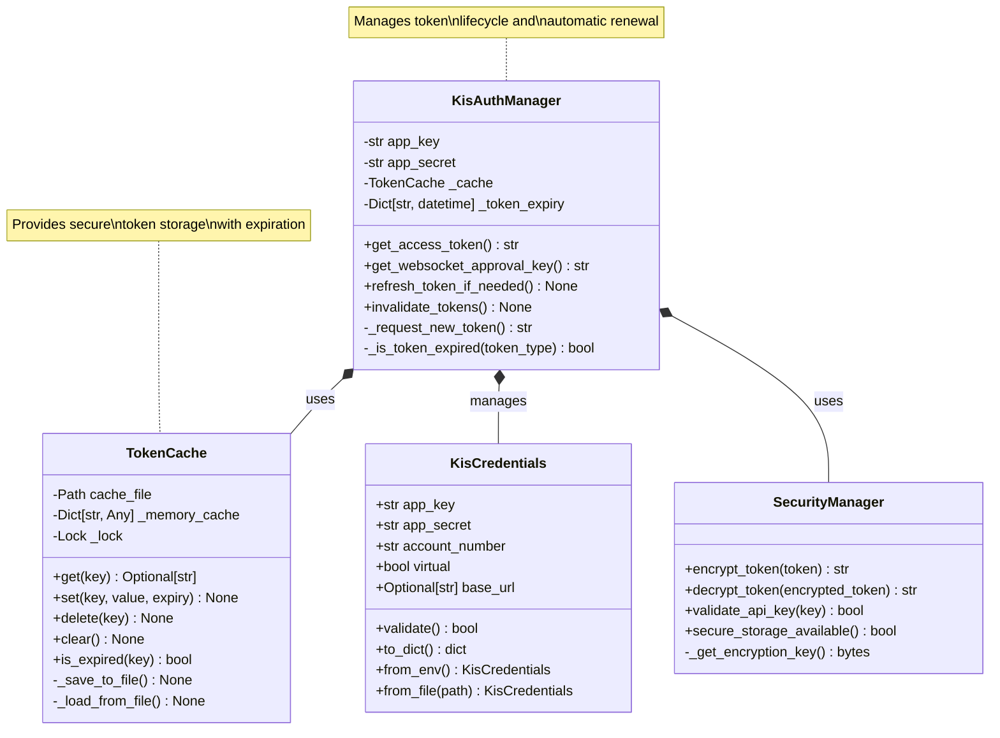
```mermaid
classDiagram
    class KisAuthManager {
        -str app_key
        -str app_secret
        -TokenCache _cache
        -Dict[str, datetime] _token_expiry
        
        +get_access_token() str
        +get_websocket_approval_key() str
        +refresh_token_if_needed() None
        +invalidate_tokens() None
        -_request_new_token() str
        -_is_token_expired(token_type) bool
    }
    
    class TokenCache {
        -Path cache_file
        -Dict[str, Any] _memory_cache
        -Lock _lock
        
        +get(key) Optional[str]
        +set(key, value, expiry) None
        +delete(key) None
        +clear() None
        +is_expired(key) bool
        -_save_to_file() None
        -_load_from_file() None
    }
    
    class KisCredentials {
        +str app_key
        +str app_secret
        +str account_number
        +bool virtual
        +Optional[str] base_url
        
        +validate() bool
        +to_dict() dict
        +from_env() KisCredentials
        +from_file(path) KisCredentials
    }
    
    class SecurityManager {
        +encrypt_token(token) str
        +decrypt_token(encrypted_token) str
        +validate_api_key(key) bool
        +secure_storage_available() bool
        -_get_encryption_key() bytes
    }
    
    KisAuthManager *-- TokenCache : uses
    KisAuthManager *-- KisCredentials : manages
    KisAuthManager *-- SecurityManager : uses
    
    note for KisAuthManager "Manages token\nlifecycle and\nautomatic renewal"
    note for TokenCache "Provides secure\ntoken storage\nwith expiration"
```

### Security Flow

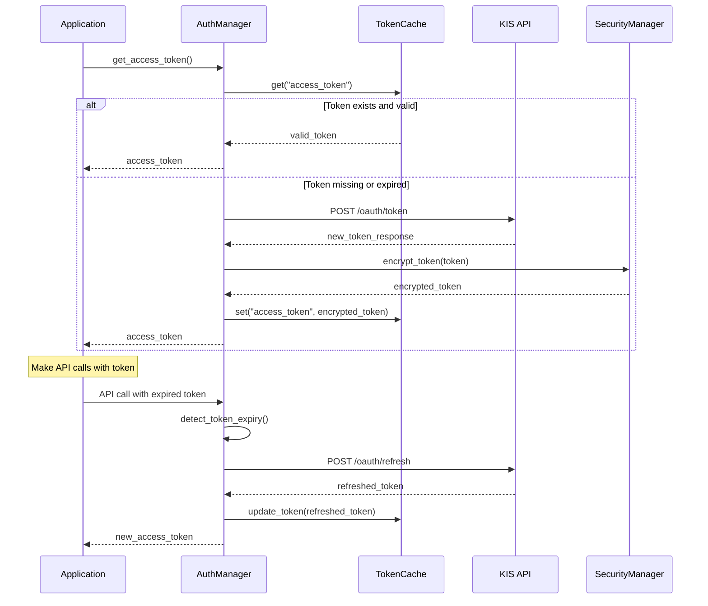
```mermaid
sequenceDiagram
    participant App as Application
    participant Auth as AuthManager
    participant Cache as TokenCache
    participant KIS as KIS API
    participant Security as SecurityManager
    
    App->>Auth: get_access_token()
    Auth->>Cache: get("access_token")
    
    alt Token exists and valid
        Cache-->>Auth: valid_token
        Auth-->>App: access_token
    else Token missing or expired
        Auth->>KIS: POST /oauth/token
        KIS-->>Auth: new_token_response
        Auth->>Security: encrypt_token(token)
        Security-->>Auth: encrypted_token
        Auth->>Cache: set("access_token", encrypted_token)
        Auth-->>App: access_token
    end
    
    Note over App: Make API calls with token
    
    App->>Auth: API call with expired token
    Auth->>Auth: detect_token_expiry()
    Auth->>KIS: POST /oauth/refresh
    KIS-->>Auth: refreshed_token
    Auth->>Cache: update_token(refreshed_token)
    Auth-->>App: new_access_token
```

---

## Module Interaction Patterns

### Inter-Module Communication

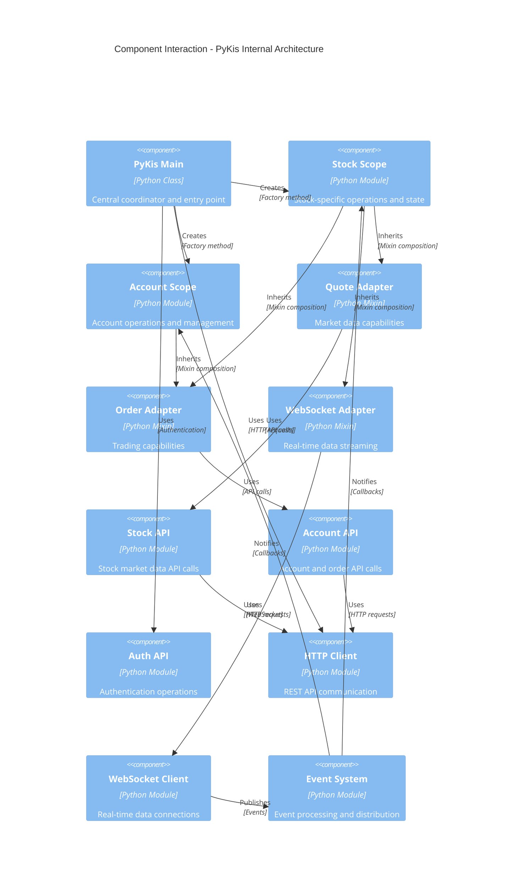
```mermaid
C4Component
    title Component Interaction - PyKis Internal Architecture
    
    Component(pykis_main, "PyKis Main", "Python Class", "Central coordinator and entry point")
    Component(scope_stock, "Stock Scope", "Python Module", "Stock-specific operations and state")
    Component(scope_account, "Account Scope", "Python Module", "Account operations and management")
    
    Component(adapter_quote, "Quote Adapter", "Python Mixin", "Market data capabilities")
    Component(adapter_order, "Order Adapter", "Python Mixin", "Trading capabilities")
    Component(adapter_websocket, "WebSocket Adapter", "Python Mixin", "Real-time data streaming")
    
    Component(api_stock, "Stock API", "Python Module", "Stock market data API calls")
    Component(api_account, "Account API", "Python Module", "Account and order API calls")
    Component(api_auth, "Auth API", "Python Module", "Authentication operations")
    
    Component(client_http, "HTTP Client", "Python Module", "REST API communication")
    Component(client_websocket, "WebSocket Client", "Python Module", "Real-time data connections")
    Component(event_system, "Event System", "Python Module", "Event processing and distribution")
    
    Rel(pykis_main, scope_stock, "Creates", "Factory method")
    Rel(pykis_main, scope_account, "Creates", "Factory method")
    Rel(pykis_main, client_http, "Uses", "HTTP requests")
    Rel(pykis_main, api_auth, "Uses", "Authentication")
    
    Rel(scope_stock, adapter_quote, "Inherits", "Mixin composition")
    Rel(scope_stock, adapter_websocket, "Inherits", "Mixin composition")
    Rel(scope_stock, adapter_order, "Inherits", "Mixin composition")
    
    Rel(scope_account, adapter_order, "Inherits", "Mixin composition")
    
    Rel(adapter_quote, api_stock, "Uses", "API calls")
    Rel(adapter_order, api_account, "Uses", "API calls")
    Rel(adapter_websocket, client_websocket, "Uses", "WebSocket")
    
    Rel(api_stock, client_http, "Uses", "HTTP requests")
    Rel(api_account, client_http, "Uses", "HTTP requests")
    
    Rel(client_websocket, event_system, "Publishes", "Events")
    Rel(event_system, scope_stock, "Notifies", "Callbacks")
    Rel(event_system, scope_account, "Notifies", "Callbacks")
```

### Dependency Graph

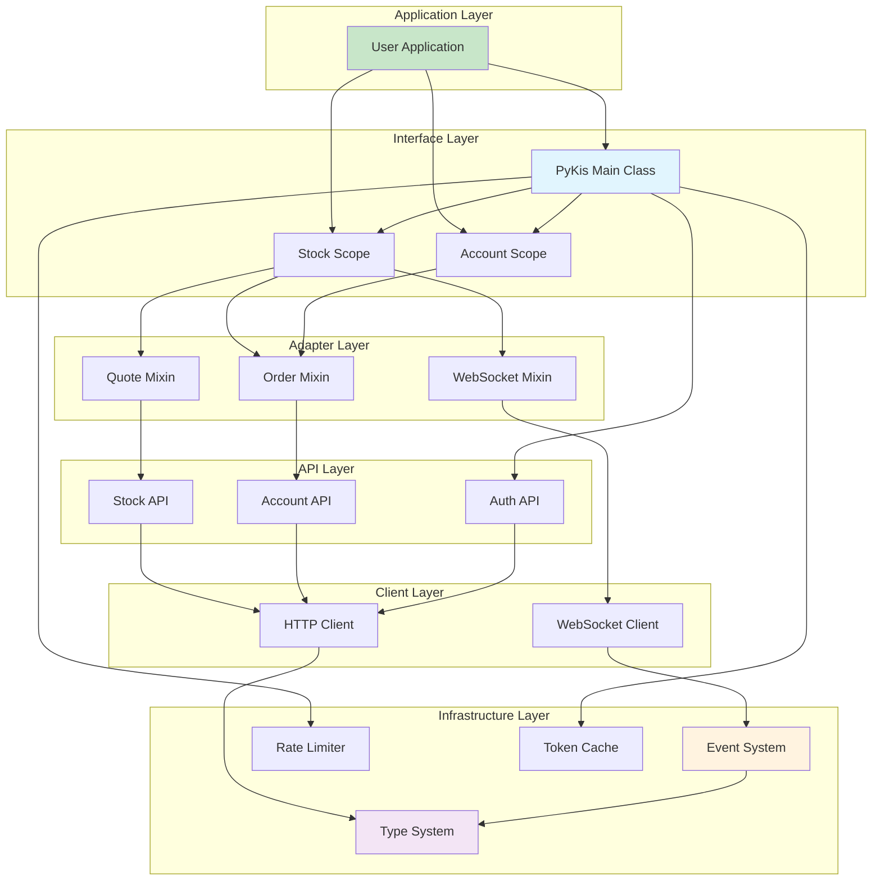
```mermaid
flowchart TD
    subgraph "Application Layer"
        USER[User Application]
    end
    
    subgraph "Interface Layer"
        PYKIS[PyKis Main Class]
        STOCK_SCOPE[Stock Scope]
        ACCOUNT_SCOPE[Account Scope]
    end
    
    subgraph "Adapter Layer"
        QUOTE_MIXIN[Quote Mixin]
        ORDER_MIXIN[Order Mixin]
        WS_MIXIN[WebSocket Mixin]
    end
    
    subgraph "API Layer"
        STOCK_API[Stock API]
        ACCOUNT_API[Account API]
        AUTH_API[Auth API]
    end
    
    subgraph "Client Layer"
        HTTP_CLIENT[HTTP Client]
        WS_CLIENT[WebSocket Client]
    end
    
    subgraph "Infrastructure Layer"
        EVENT_SYSTEM[Event System]
        RATE_LIMIT[Rate Limiter]
        TOKEN_CACHE[Token Cache]
        TYPE_SYSTEM[Type System]
    end
    
    USER --> PYKIS
    USER --> STOCK_SCOPE
    USER --> ACCOUNT_SCOPE
    
    PYKIS --> STOCK_SCOPE
    PYKIS --> ACCOUNT_SCOPE
    PYKIS --> AUTH_API
    PYKIS --> RATE_LIMIT
    PYKIS --> TOKEN_CACHE
    
    STOCK_SCOPE --> QUOTE_MIXIN
    STOCK_SCOPE --> ORDER_MIXIN
    STOCK_SCOPE --> WS_MIXIN
    
    ACCOUNT_SCOPE --> ORDER_MIXIN
    
    QUOTE_MIXIN --> STOCK_API
    ORDER_MIXIN --> ACCOUNT_API
    WS_MIXIN --> WS_CLIENT
    
    STOCK_API --> HTTP_CLIENT
    ACCOUNT_API --> HTTP_CLIENT
    AUTH_API --> HTTP_CLIENT
    
    WS_CLIENT --> EVENT_SYSTEM
    
    HTTP_CLIENT --> TYPE_SYSTEM
    EVENT_SYSTEM --> TYPE_SYSTEM
    
    style USER fill:#c8e6c9
    style PYKIS fill:#e1f5fe
    style EVENT_SYSTEM fill:#fff3e0
    style TYPE_SYSTEM fill:#f3e5f5
```

---

## Scalability and Performance Considerations

### Performance Optimization Strategies

```mermaid
block-beta
    columns 3
    
    block:performance_layer:3
        columns 3
        Caching["Response Caching"] Connection_Pool["Connection Pooling"] Rate_Limiting["Rate Limiting"]
    end
    
    block:optimization_layer:3
        columns 3
        Async_Processing["Async Event Processing"] Subscription_Mgmt["Smart Subscription Management"] Resource_Cleanup["Automatic Resource Cleanup"]
    end
    
    block:monitoring_layer:3
        columns 3
        Metrics["Performance Metrics"] Health_Check["Health Monitoring"] Error_Recovery["Error Recovery"]
    end
    
    Caching --> Async_Processing
    Connection_Pool --> Subscription_Mgmt
    Rate_Limiting --> Resource_Cleanup
    
    Async_Processing --> Metrics
    Subscription_Mgmt --> Health_Check
    Resource_Cleanup --> Error_Recovery
    
    style Caching fill:#e8f5e8
    style Connection_Pool fill:#e8f5e8
    style Rate_Limiting fill:#e8f5e8
    style Async_Processing fill:#e1f5fe
    style Subscription_Mgmt fill:#e1f5fe
    style Resource_Cleanup fill:#e1f5fe
    style Metrics fill:#fff3e0
    style Health_Check fill:#fff3e0
    style Error_Recovery fill:#fff3e0
```

### Memory Management Architecture

```mermaid
classDiagram
    class ResourceManager {
        -WeakSet active_scopes
        -Dict subscription_refs
        -Timer cleanup_timer
        
        +register_scope(scope) None
        +cleanup_inactive_scopes() None
        +monitor_memory_usage() None
        -_gc_collect() None
    }
    
    class SubscriptionManager {
        -Dict[str, WeakRef] subscriptions
        -int max_subscriptions
        -Queue subscription_queue
        
        +add_subscription(sub) str
        +remove_subscription(sub_id) None
        +cleanup_dead_subscriptions() None
        +get_subscription_count() int
    }
    
    class CacheManager {
        -LRUCache response_cache
        -TTLCache token_cache
        -int max_cache_size
        
        +get(key) Optional[Any]
        +set(key, value, ttl) None
        +evict_expired() None
        +clear_cache() None
    }
    
    class ConnectionPool {
        -Queue available_connections
        -Set active_connections
        -int max_connections
        -int connection_timeout
        
        +get_connection() Connection
        +return_connection(conn) None
        +close_all_connections() None
        +health_check() None
    }
    
    ResourceManager *-- SubscriptionManager : uses
    ResourceManager *-- CacheManager : uses
    ResourceManager *-- ConnectionPool : uses
    
    note for ResourceManager "Coordinates resource\ncleanup and monitoring"
    note for SubscriptionManager "Manages WebSocket\nsubscriptions with limits"
```

---

## Conclusion

The PyKis library demonstrates exceptional architectural sophistication through its use of modern Python design patterns and enterprise-grade infrastructure considerations. The combination of protocol-based type safety, adapter pattern composition, and robust real-time data handling creates a powerful and maintainable trading library.

### Key Architectural Achievements

1. **Type Safety**: Comprehensive use of Python protocols ensures compile-time checking and excellent IDE support
2. **Modularity**: Clear separation of concerns through scope-based organization and mixin composition
3. **Real-time Capabilities**: Robust WebSocket infrastructure with automatic reconnection and subscription management
4. **Resource Management**: Sophisticated cleanup and monitoring systems prevent memory leaks
5. **Extensibility**: Well-designed adapter patterns allow easy feature extension without core modifications

### Areas for Potential Enhancement

1. **API Specification Synchronization**: Regular updates to match current KIS API changes
2. **Test Coverage**: Expanded integration testing for complex interaction scenarios  
3. **Performance Monitoring**: Enhanced metrics collection for production optimization
4. **Documentation**: Continued synchronization with evolving API capabilities

### Architecture Quality Summary

| Component | Design Quality | Implementation | Maintainability |
|-----------|---------------|----------------|-----------------|
| **Core Architecture** | ⭐⭐⭐⭐⭐ | ⭐⭐⭐⭐ | ⭐⭐⭐⭐ |
| **Type System** | ⭐⭐⭐⭐⭐ | ⭐⭐⭐⭐⭐ | ⭐⭐⭐⭐⭐ |
| **Real-time Infrastructure** | ⭐⭐⭐⭐⭐ | ⭐⭐⭐⭐ | ⭐⭐⭐⭐ |
| **API Layer** | ⭐⭐⭐⭐ | ⭐⭐⭐ | ⭐⭐⭐ |
| **Event System** | ⭐⭐⭐⭐⭐ | ⭐⭐⭐⭐ | ⭐⭐⭐⭐ |

This architectural analysis reveals PyKis as a well-engineered solution that successfully balances complexity with usability, making it an excellent foundation for algorithmic trading applications in the Korean securities market.
